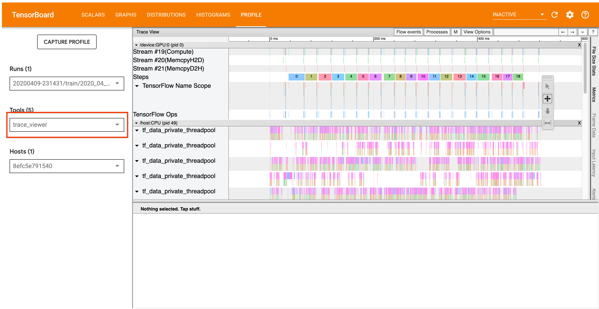
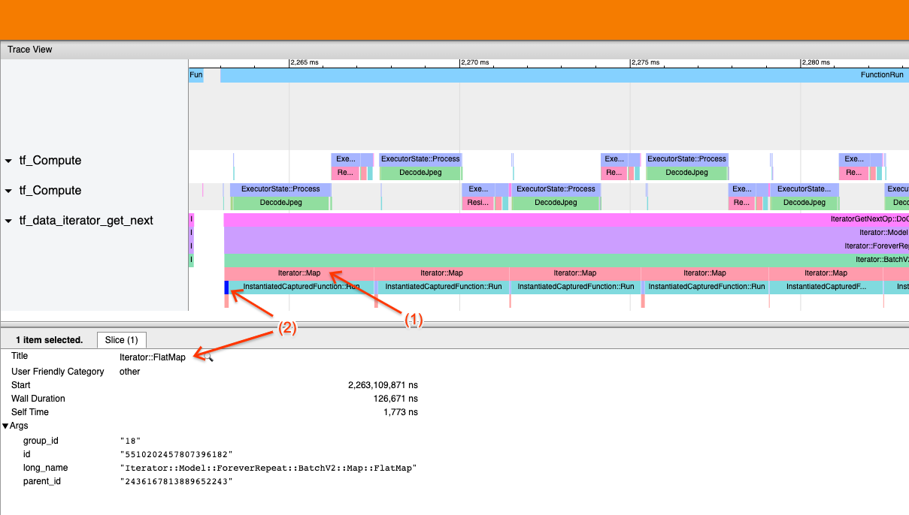
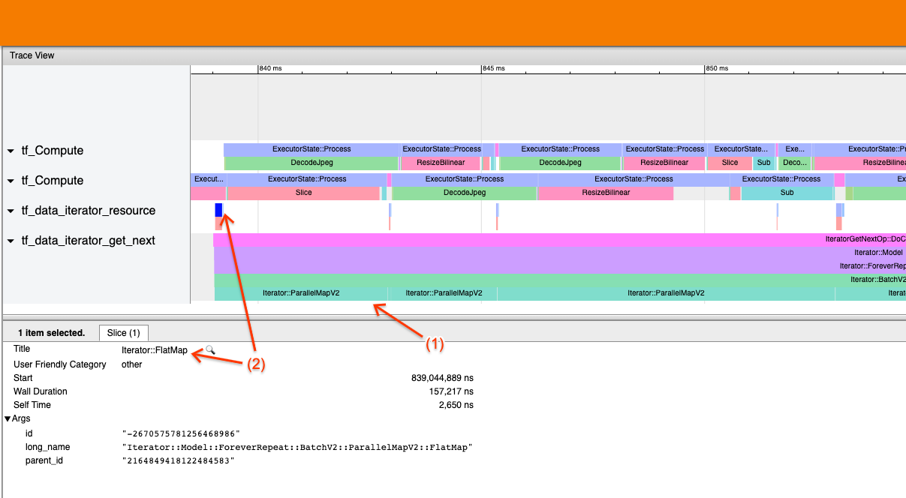

# Analyze `tf.data` performance with the TF Profiler

## Overview

This guide assumes familiarity with the TensorFlow
[Profiler](https://www.tensorflow.org/guide/profiler) and
[`tf.data`](https://www.tensorflow.org/guide/data). It aims to provide step by
step instructions with examples to help users diagnose and fix input pipeline
performance issues.

To begin, collect a profile of your TensorFlow job. Instructions on how to do so
are available for
[CPUs/GPUs](https://www.tensorflow.org/guide/profiler#collect_performance_data)
and
[Cloud TPUs](https://cloud.google.com/tpu/docs/cloud-tpu-tools#capture_profile).



The analysis workflow detailed below focuses on the trace viewer tool in the
Profiler. This tool displays a timeline that shows the duration of ops executed
by your TensorFlow program and allows you to identify which ops take the longest
to execute. For more information on the trace viewer, check out
[this section](https://www.tensorflow.org/guide/profiler#trace_viewer) of the TF
Profiler guide. In general, `tf.data` events will appear on the host CPU
timeline.

## Analysis Workflow

_Please follow the workflow below. If you have feedback to help us improve it,
please
[create a github issue](https://github.com/tensorflow/tensorflow/issues/new/choose)
with the label “comp:data”._

### 1. Is your `tf.data` pipeline producing data fast enough?

Begin by ascertaining whether the input pipeline is the bottleneck for your
TensorFlow program.

To do so, look for `IteratorGetNext::DoCompute` ops in the trace viewer. In
general, you expect to see these at the start of a step. These slices represent
the time it takes for your input pipeline to yield a batch of elements when it
is requested. If you’re using keras or iterating over your dataset in a
`tf.function`, these should be found in `tf_data_iterator_get_next` threads.

Note that if you’re using a
[distribution strategy](https://www.tensorflow.org/guide/distributed_training),
you may see `IteratorGetNextAsOptional::DoCompute` events instead of
`IteratorGetNext::DoCompute`(as of TF 2.3).


**If the calls return quickly (<= 50 us),** this means that your data is
available when it is requested. The input pipeline is not your bottleneck; see
the [Profiler guide](https://www.tensorflow.org/guide/profiler) for more generic
performance analysis tips.


**If the calls return slowly,** `tf.data` is unable to keep up with the
consumer’s requests. Continue to the next section.

### 2. Are you prefetching data?

The best practice for input pipeline performance is to insert a
`tf.data.Dataset.prefetch` transformation at the end of your `tf.data` pipeline.
This transformation overlaps the input pipeline’s preprocessing computation with
the next step of model computation and is required for optimal input pipeline
performance when training your model. If you’re prefetching data, you should see
a `Iterator::Prefetch` slice on the same thread as the
`IteratorGetNext::DoCompute` op.


**If you don’t have a `prefetch` at the end of your pipeline**, you should add
one. For more information about `tf.data` performance recommendations, see the
[tf.data performance guide](https://www.tensorflow.org/guide/data_performance#prefetching).

**If you’re already prefetching data**, and the input pipeline is still your
bottleneck, continue to the next section to further analyze performance.

### 3. Are you reaching high CPU utilization?

`tf.data` achieves high throughput by trying to make the best possible use of
available resources. In general, even when running your model on an accelerator
like a GPU or TPU, the `tf.data` pipelines are run on the CPU. You can check
your utilization with tools like [sar](https://linux.die.net/man/1/sar) and
[htop](https://en.wikipedia.org/wiki/Htop), or in the
[cloud monitoring console](https://cloud.google.com/monitoring/docs/monitoring_in_console) if you’re running on GCP.

**If your utilization is low,** this suggests that your input pipeline may not
be taking full advantage of the host CPU. You should consult the
[tf.data performance guide](https://www.tensorflow.org/guide/data_performance)
for best practices. If you have applied the best practices and utilization and
throughput remain low, continue to [Bottleneck analysis](#4_bottleneck_analysis)
below.

**If your utilization is approaching the resource limit**, in order to improve
performance further, you need to either improve the efficiency of your input
pipeline (for example, avoiding unnecessary computation) or offload computation.

You can improve the efficiency of your input pipeline by avoiding unnecessary
computation in `tf.data`. One way of doing this is inserting a
[`tf.data.Dataset.cache`](https://www.tensorflow.org/guide/data_performance#caching)
transformation after computation-intensive work if your data fits into memory;
this reduces computation at the cost of increased memory usage. Additionally,
disabling intra-op parallelism in `tf.data` has the potential to increase
efficiency by > 10%, and can be done by setting the following option on your
input pipeline:

```python
dataset = ...
options = tf.data.Options()
options.experimental_threading.max_intra_op_parallelism = 1
dataset = dataset.with_options(options)
```

### 4. Bottleneck Analysis

The following section walks through how to read `tf.data` events in the trace
viewer to understand where the bottleneck is and possible mitigation strategies.

#### Understanding `tf.data` events in the Profiler

Each `tf.data` event in the Profiler has the name `Iterator::<Dataset>`, where
`<Dataset>` is the name of the dataset source or transformation. Each event also
has the long name `Iterator::<Dataset_1>::...::<Dataset_n>`, which you can see
by clicking on the `tf.data` event. In the long name, `<Dataset_n>` matches
`<Dataset>` from the (short) name, and the other datasets in the long name
represent downstream transformations.

.map(lambda x: x).repeat(2).batch(5)")

For example, the above screenshot was generated from the following code:

```python
dataset = tf.data.Dataset.range(10)
dataset = dataset.map(lambda x: x)
dataset = dataset.repeat(2)
dataset = dataset.batch(5)
```

Here, the `Iterator::Map` event has the long name
`Iterator::BatchV2::FiniteRepeat::Map`. Note that the datasets name may differ
slightly from the python API (for example, FiniteRepeat instead of Repeat), but
should be intuitive enough to parse.

##### Synchronous and asynchronous transformations

For synchronous `tf.data` transformations (such as `Batch` and `Map`), you will
see events from upstream transformations on the same thread. In the above
example, since all the transformations used are synchronous, all the events
appear on the same thread.

For asynchronous transformations (such as `Prefetch`, `ParallelMap`,
`ParallelInterleave` and `MapAndBatch`) events from upstream transformations
will be on a different thread. In such cases, the “long name” can help you
identify which transformation in a pipeline an event corresponds to.

.map(lambda x: x).repeat(2).batch(5).prefetch(1)")

For example, the above screenshot was generated from the following code:

```python
dataset = tf.data.Dataset.range(10)
dataset = dataset.map(lambda x: x)
dataset = dataset.repeat(2)
dataset = dataset.batch(5)
dataset = dataset.prefetch(1)
```

Here, the `Iterator::Prefetch` events are on the `tf_data_iterator_get_next`
threads. Since `Prefetch` is asynchronous, its input events (`BatchV2`) will be
on a different thread, and can be located by searching for the long name
`Iterator::Prefetch::BatchV2`. In this case, they are on the
`tf_data_iterator_resource` thread. From its long name, you can deduce that
`BatchV2` is upstream of `Prefetch`. Furthermore, the `parent_id` of the
`BatchV2` event will match the ID of the `Prefetch` event.

#### Identifying the bottleneck

In general, to identify the bottleneck in your input pipeline, walk the input
pipeline from the outermost transformation all the way to the source. Starting
from the final transformation in your pipeline, recurse into upstream
transformations until you find a slow transformation or reach a source dataset,
such as `TFRecord`. In the example above, you would start from `Prefetch`, then
walk upstream to `BatchV2`, `FiniteRepeat`, `Map`, and finally `Range`.

In general, a slow transformation corresponds to one whose events are long, but
whose input events are short. Some examples follow below.

Note that the final (outermost) transformation in most host input pipelines is
the `Iterator::Model` event. The Model transformation is introduced
automatically by the `tf.data` runtime and is used for instrumenting and
autotuning the input pipeline performance.

If your job is using a
[distribution strategy](https://www.tensorflow.org/guide/distributed_training),
the trace viewer will contain additional events that correspond to the device
input pipeline. The outermost transformation of the device pipeline (nested
under `IteratorGetNextOp::DoCompute` or
`IteratorGetNextAsOptionalOp::DoCompute`) will be an `Iterator::Prefetch` event
with an upstream `Iterator::Generator` event. You can find the corresponding
host pipeline by searching for `Iterator::Model` events.

##### Example 1



The above screenshot is generated from the following input pipeline:

```python
dataset = tf.data.TFRecordDataset(filename)
dataset = dataset.map(parse_record)
dataset = dataset.batch(32)
dataset = dataset.repeat()
```

In the screenshot, observe that (1) `Iterator::Map` events are long, but (2) its
input events (`Iterator::FlatMap`) return quickly. This suggests that the
sequential Map transformation is the bottleneck.

Note that in the screenshot, the `InstantiatedCapturedFunction::Run` event
corresponds to the time it takes to execute the map function.

##### Example 2



The above screenshot is generated from the following input pipeline:

```python
dataset = tf.data.TFRecordDataset(filename)
dataset = dataset.map(parse_record, num_parallel_calls=2)
dataset = dataset.batch(32)
dataset = dataset.repeat()
```

This example is similar to the above, but uses ParallelMap instead of Map. We
notice here that (1) `Iterator::ParallelMap` events are long, but (2) its input
events `Iterator::FlatMap` (which are on a different thread, since ParallelMap
is asynchronous) are short. This suggests that the ParallelMap transformation is
the bottleneck.

#### Addressing the bottleneck

##### Source datasets

If you’ve identified a dataset source as the bottleneck, such as reading from
TFRecord files, you can improve performance by parallelizing data extraction. To
do so, ensure that your data is sharded across multiple files and use
`tf.data.Dataset.interleave` with the `num_parallel_calls` parameter set to
`tf.data.AUTOTUNE`. If determinism is not important to your
program, you can further improve performance by setting the
`deterministic=False` flag on `tf.data.Dataset.interleave` as of TF 2.2. For
example, if you’re reading from TFRecords, you can do the following:

```python
dataset = tf.data.Dataset.from_tensor_slices(filenames)
dataset = dataset.interleave(tf.data.TFRecordDataset,
  num_parallel_calls=tf.data.AUTOTUNE,
  deterministic=False)
```

Note that sharded files should be reasonably large to amortize the overhead of
opening a file. For more details on parallel data extraction, see
[this section](https://www.tensorflow.org/guide/data_performance#parallelizing_data_extraction)
of the `tf.data` performance guide.

##### Transformation datasets

If you’ve identified an intermediate `tf.data` transformation as the bottleneck,
you can address it by parallelizing the transformation or
[caching the computation](https://www.tensorflow.org/guide/data_performance#caching)
if your data fits into memory and it is appropriate. Some transformations such
as `Map` have parallel counterparts; the
[`tf.data` performance guide demonstrates](https://www.tensorflow.org/guide/data_performance#parallelizing_data_transformation)
how to parallelize these. Other transformations, such as `Filter`, `Unbatch`,
and `Batch` are inherently sequential; you can parallelize them by introducing
“outer parallelism”. For example, supposing your input pipeline initially looks
like the following, with `Batch` as the bottleneck:

```python
filenames = tf.data.Dataset.list_files(file_path, shuffle=is_training)
dataset = filenames_to_dataset(filenames)
dataset = dataset.batch(batch_size)
```

You can introduce “outer parallelism” by running multiple copies of the input
pipeline over sharded inputs and combining the results:

```python
filenames = tf.data.Dataset.list_files(file_path, shuffle=is_training)

def make_dataset(shard_index):
  filenames = filenames.shard(NUM_SHARDS, shard_index)
  dataset = filenames_to_dataset(filenames)
  Return dataset.batch(batch_size)

indices = tf.data.Dataset.range(NUM_SHARDS)
dataset = indices.interleave(make_dataset,
                             num_parallel_calls=tf.data.AUTOTUNE)
dataset = dataset.prefetch(tf.data.AUTOTUNE)
```

## Additional resources

*   [tf.data performance guide](https://www.tensorflow.org/guide/data_performance)
    on how to write performance `tf.data` input pipelines
*   [Inside TensorFlow video: `tf.data` best practices ](https://www.youtube.com/watch?v=ZnukSLKEw34)
*   [Profiler guide](https://www.tensorflow.org/guide/profiler)
*   [Profiler tutorial with colab](https://www.tensorflow.org/tensorboard/tensorboard_profiling_keras)
