# Optimize TensorFlow GPU performance with the TensorFlow Profiler

## Overview

This guide will show you how to use the TensorFlow Profiler with TensorBoard to
gain insight into and get the maximum performance out of your GPUs, and debug
when one or more of your GPUs are underutilized.

If you are new to the Profiler:

-   Get started with the
    [TensorFlow Profiler: Profile model performance](https://www.tensorflow.org/tensorboard/tensorboard_profiling_keras)
    notebook with a Keras example and
    [TensorBoard](https://www.tensorflow.org/tensorboard).
-   Learn about various profiling tools and methods available for optimizing
    TensorFlow performance on the host (CPU) with the
    [Optimize TensorFlow performance using the Profiler](https://www.tensorflow.org/guide/profiler#profiler_tools)
    guide.

Keep in mind that offloading computations to GPU may not always be beneficial,
particularly for small models. There can be overhead due to:

-   Data transfer between the host (CPU) and the device (GPU); and
-   Due to the latency involved when the host launches GPU kernels.

### Performance optimization workflow

This guide outlines how to debug performance issues starting with a single GPU,
then moving to a single host with multiple GPUs.

It is recommended to debug performance issues in the following order:

1.  Optimize and debug the performance on one GPU:
    1.  Check if the input pipeline is a bottleneck.
    2.  Debug the performance of one GPU.
    3.  Enable mixed precision (with `fp16` (float16)) and optionally enable
        [XLA](https://www.tensorflow.org/xla).
2.  Optimize and debug the performance on the multi-GPU single host.

For example, if you are using a TensorFlow
[distribution strategy](https://www.tensorflow.org/guide/distributed_training)
to train a model on a single host with multiple GPUs and notice suboptimal GPU
utilization, you should first optimize and debug the performance for one GPU
before debugging the multi-GPU system.

As a baseline for getting performant code on GPUs, this guide assumes you are
already using `tf.function`. The Keras `Model.compile` and `Model.fit` APIs will
utilize `tf.function` automatically under the hood. When writing a custom
training loop with `tf.GradientTape`, refer to the
[Better performance with tf.function](https://www.tensorflow.org/guide/function)
on how to enable `tf.function`s.

The next sections discuss suggested approaches for each of the scenarios above
to help identify and fix performance bottlenecks.

## 1. Optimize the performance on one GPU

In an ideal case, your program should have high GPU utilization, minimal CPU
(the host) to GPU (the device) communication, and no overhead from the input
pipeline.

The first step in analyzing the performance is to get a profile for a model
running with one GPU.

TensorBoard's Profiler
[overview page](https://www.tensorflow.org/guide/profiler#overview_page)—which
shows a top level view of how your model performed during a profile run—can
provide an idea of how far away your program is from the ideal scenario.

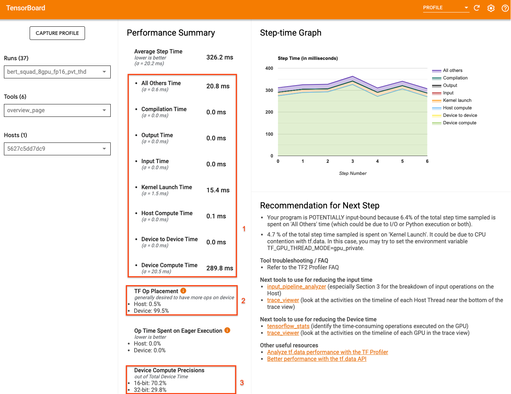

The key numbers to pay attention to the overview page are:

1.  How much of the step time is from actual device execution
2.  The percentage of ops placed on device vs host
3.  How many kernels use `fp16`

Achieving optimal performance means maximizing these numbers in all three cases.
To get an in-depth understanding of your program, you will need to be familiar
with TensorBoard's Profiler
[trace viewer](https://www.tensorflow.org/guide/profiler#trace_viewer). The
sections below show some common trace viewer patterns that you should look for
when diagnosing performance bottlenecks.

Below is an image of a model trace view running on one GPU. From the _TensorFlow
Name Scope_ and _TensorFlow Ops_ sections, you can identify different parts of
the model, like the forward pass, the loss function, backward pass/gradient
calculation, and the optimizer weight update. You can also have the ops running
on the GPU next to each _Stream_, which refer to CUDA streams. Each stream is
used for specific tasks. In this trace, _Stream#118_ is used to launch compute
kernels and device-to-device copies. _Stream#119_ is used for host-to-device
copy and *Stream#120* for device to host copy.

The trace below shows common characteristics of a performant model.

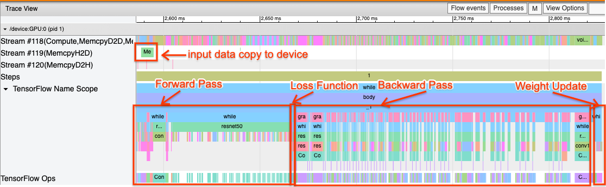

For example, the GPU compute timeline (_Stream#118_) looks "busy" with very few
gaps. There are minimal copies from host to device (_Stream #119_) and from
device to host (_Stream #120_), as well as minimal gaps between steps. When you
run the Profiler for your program, you may not be able to identify these ideal
characteristics in your trace view. The rest of this guide covers common
scenarios and how to fix them.

### 1. Debug the input pipeline

The first step in GPU performance debugging is to determine if your program is
input-bound. The easiest way to figure this out is to use the Profiler’s
[Input-pipeline analyzer](https://www.tensorflow.org/guide/profiler#input_pipeline_analyzer),
on TensorBoard, which provides an overview of time spent in the input pipeline.

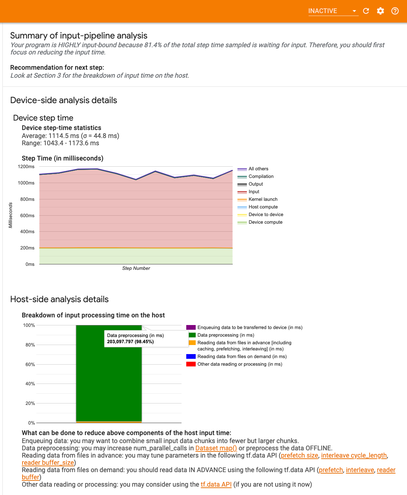

You can take the following potential actions if your input-pipeline contributes
significantly to step time:

-   You can use the `tf.data`-specific
    [guide](https://www.tensorflow.org/guide/data_performance_analysis) to learn
    how to debug your input pipeline.
-   Another quick way to check if the input pipeline is the bottleneck is to use
    randomly generated input data that does not need any pre-processing.
    [Here is an example](https://github.com/tensorflow/models/blob/4a5770827edf1c3974274ba3e4169d0e5ba7478a/official/vision/image_classification/resnet/resnet_runnable.py#L50-L57)
    of using this technique for a ResNet model. If the input pipeline is
    optimal, you should experience similar performance with real data and with
    generated random/synthetic data. The only overhead in the synthetic data
    case will be due to input data copy which again can be prefetched and
    optimized.

In addition, refer to the
[best practices for optimizing the input data pipeline](https://www.tensorflow.org/guide/profiler#optimize_the_input_data_pipeline).

### 2. Debug the performance of one GPU

There are several factors that can contribute to low GPU utilization. Below are
some scenarios commonly observed when looking at the
[trace viewer](https://www.tensorflow.org/guide/profiler#trace_viewer) and
potential solutions.

#### 1. Analyze gaps between steps

A common observation when your program is not running optimally is gaps between
training steps. In the image of the trace view below, there is a large gap
between steps 8 and 9, meaning that the GPU is idle during that time.


If your trace viewer shows large gaps between steps, this could be an indication
that your program is input bound. In that case you should refer to the previous
section on debugging your input pipeline if you have not already done so.

However, even with an optimized input pipeline, you can still have gaps between
the end of one step and the start of another due to CPU thread contention.
`tf.data` makes use of background threads to parallelize pipeline processing.
These threads may interfere with GPU host-side activity that happens at the
beginning of each step, such as copying data or scheduling GPU operations.

If you notice large gaps on the host side, which schedules these ops on the GPU,
you can set the environment variable `TF_GPU_THREAD_MODE=gpu_private`. This
ensures that GPU kernels are launched from their own dedicated threads, and
don't get queued behind `tf.data` work.

Gaps between steps can also be caused by metric calculations, Keras callbacks,
or ops outside of `tf.function` that run on the host. These ops don’t have as
good performance as the ops inside a TensorFlow graph. Additionally, some of
these ops run on the CPU and copy tensors back and forth from the GPU.

If after optimizing your input pipeline you still notice gaps between steps in
the trace viewer, you should look at the model code between steps and check if
disabling callbacks/metrics improves performance. Some details of these ops are
also on the trace viewer (both device and host side).The recommendation in this
scenario is to amortize the overhead of these ops by executing them after a
fixed number of steps instead of every step. When using the `compile` method in
the `tf.keras` API, setting the `experimental_steps_per_execution` flag does
this automatically. For custom training loops, use `tf.while_loop`.

#### 2. Achieve higher device utilization

##### 1. Small GPU kernels and host kernel launch delays

The host enqueues kernels to be run on the GPU, but there is a latency (around
20-40 μs) involved before kernels are actually executed on the GPU. In an ideal
case, the host enqueues enough kernels on the GPU such that the GPU spends most
of its time executing, rather than waiting on the host to enqueue more kernels.

The Profiler's
[overview page](https://www.tensorflow.org/guide/profiler#overview_page) on
TensorBoard shows how much time the GPU was idle due to waiting on the host to
launch kernels. In the image below, the GPU is idle for about 10% of the step
time waiting on kernels to be launched.

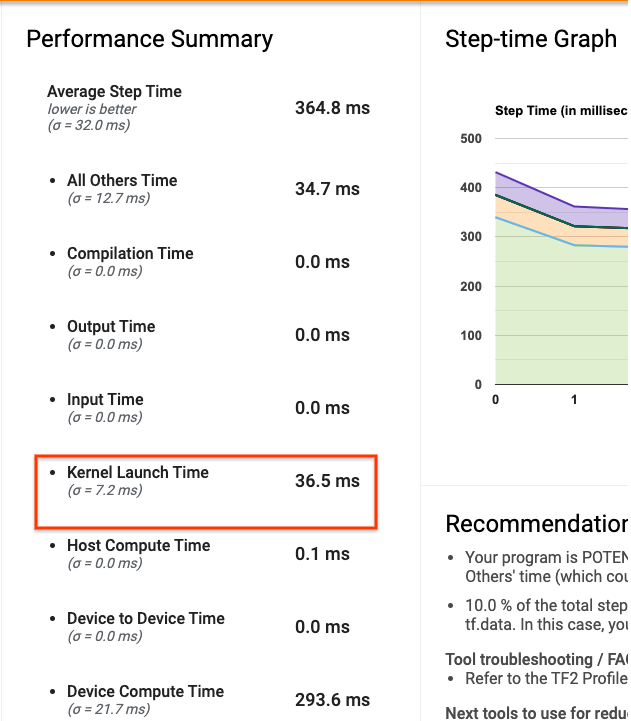

The [trace viewer](https://www.tensorflow.org/guide/profiler#trace_viewer) for
this same program shows small gaps between kernels where the host is busy
launching kernels on the GPU.

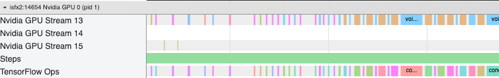

By launching a lot of small ops on the GPU (like a scalar add, for example), the
host might not keep up with the GPU. The
[TensorFlow Stats](https://www.tensorflow.org/guide/profiler#tensorflow_stats)
tool in TensorBoard for the same Profile shows 126,224 Mul operations taking
2.77 seconds. Thus, each kernel is about 21.9 μs, which is very small (around
the same time as launch latency) and can potentially result in host kernel
launch delays.

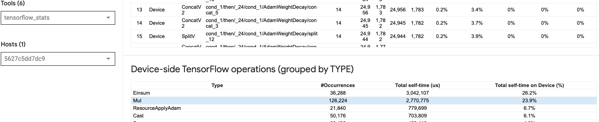

If your [trace viewer](https://www.tensorflow.org/guide/profiler#trace_viewer)
shows many small gaps between ops on the GPU like in the image above, you can:

-   Concatenate small tensors and use vectorized ops or use a larger batch size
    to make each launched kernel do more work, which will keep the GPU busy for
    longer.
-   Make sure you are using `tf.function` to create TensorFlow graphs, so that
    you are not running ops in a pure eager mode. If you are using `Model.fit`
    (as oppose to a custom training loop with `tf.GradientTape`), then
    `tf.keras.Model.compile` will automatically do this for you.
-   Fuse kernels using XLA with `tf.function(jit_compile=True)` or
    auto-clustering. For more details, go to the
    [Enable mixed precision and XLA](#3._enable_mixed_precision_and_xla) section
    below to learn how to enable XLA to get higher performance. This feature can
    lead to high device utilization.

##### 2. TensorFlow op placement

The Profiler
[overview page](https://www.tensorflow.org/guide/profiler#overview_page) shows
you the percentage of ops placed on the host vs. the device (you can also verify
the placement of specific ops by looking at the
[trace viewer](https://www.tensorflow.org/guide/profiler#trace_viewer). Like in
the image below, you want the percentage of ops on the host to be very small
compared to the device.

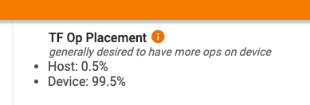

Ideally, most of the compute intensive ops should be placed on the GPU.

To find out which devices the operations and tensors in your model are assigned
to, set `tf.debugging.set_log_device_placement(True)` as the first statement of
your program.

Note that in some cases, even if you specify an op to be placed on a particular
device, its implementation might override this condition (example:`tf.unique`).
Even for single GPU training, specifying a distribution strategy, such as
`tf.distribute.OneDeviceStrategy`, can result in more deterministic placement of
ops on your device.

One reason for having the majority of ops placed on the GPU is to prevent
excessive memory copies between the host and the device (memory copies for model
input/output data between host and device are expected). An example of excessive
copying is demonstrated in the trace view below on GPU streams _#167_, _#168_,
and _#169_.

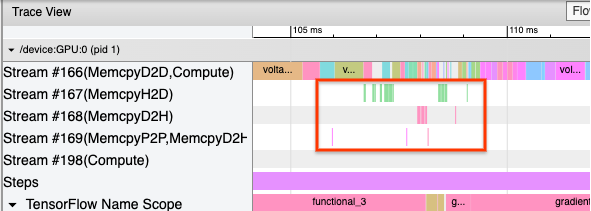

These copies can sometimes hurt the performance if they block GPU kernels from
executing. Memory copy operations in the
[trace viewer](https://www.tensorflow.org/guide/profiler#trace_viewer) have more
information about the ops that are the source of these copied tensors, but it
might not always be easy to associate a memCopy with an op. In these cases, it
is helpful to look at the ops nearby to check if the memory copy happens at the
same location in every step.

#### 3. More efficient kernels on GPUs

Once your program's GPU utilization is acceptable, the next step is to look into
increasing the efficiency of the GPU kernels by utilizing Tensor Cores or fusing
ops.

##### 1. Utilize Tensor Cores

Modern NVIDIA® GPUs have specialized
[Tensor Cores](https://www.nvidia.com/en-gb/data-center/tensor-cores/) that can
significantly improve the performance of eligible kernels.

You can use TensorBoard's
[GPU kernel stats](https://www.tensorflow.org/guide/profiler#gpu_kernel_stats)
to visualize which GPU kernels are Tensor Core-eligible, and which kernels are
using Tensor Cores. Enabling `fp16` (see Enabling Mixed Precision section below)
is one way to make your program’s General Matrix Multiply (GEMM) kernels (matmul
ops) utilize the Tensor Core. GPU kernels use the Tensor Cores efficiently when
the precision is fp16 and input/output tensor dimensions are divisible by 8 or
16 (for `int8`).

Note: With cuDNN v7.6.3 and later, convolution dimensions will automatically be
padded where necessary to leverage Tensor Cores.

For other detailed recommendations on how to make kernels efficient for GPUs,
refer to the
[NVIDIA® deep learning performance](https://docs.nvidia.com/deeplearning/performance/index.html#perf-guidelines)
guide.

##### 2. Fuse ops

Use `tf.function(jit_compile=True)` to fuse smaller ops to form bigger kernels
leading to significant performance gains. To learn more, refer to the
[XLA](https://www.tensorflow.org/xla) guide.

### 3. Enable mixed precision and XLA

After following the above steps, enabling mixed precision and XLA are two
optional steps you can take to improve performance further. The suggested
approach is to enable them one by one and verify that the performance benefits
are as expected.

#### 1. Enable mixed precision

The TensorFlow
[Mixed precision](https://www.tensorflow.org/guide/keras/mixed_precision) guide
shows how to enable `fp16` precision on GPUs. Enable
[AMP](https://developer.nvidia.com/automatic-mixed-precision) on NVIDIA® GPUs to
use Tensor Cores and realize up to 3x overall speedups when compared to using
just `fp32` (float32) precision on Volta and newer GPU architectures.

Make sure that matrix/tensor dimensions satisfy requirements for calling kernels
that use Tensor Cores. GPU kernels use the Tensor Cores efficiently when the
precision is fp16 and input/output dimensions are divisible by 8 or 16 (for
int8).

Note that with cuDNN v7.6.3 and later, convolution dimensions will automatically
be padded where necessary to leverage Tensor Cores.

Follow the best practices below to maximize the performance benefits of `fp16`
precision.

##### 1. Use optimal fp16 kernels

With `fp16` enabled, your program’s matrix multiplications (GEMM) kernels,
should use the corresponding `fp16` version that utilizes the Tensor Cores.
However, in some cases, this does not happen and you do not experience the
expected speedup from enabling `fp16`, as your program falls back to the
inefficient implementation instead.

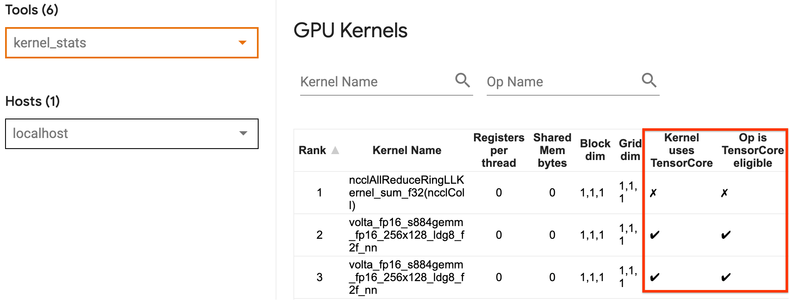

The [GPU kernel](https://www.tensorflow.org/guide/profiler#gpu_kernel_stats)
stats page shows which ops are Tensor Core eligible and which kernels are
actually using the efficient Tensor Core. The
[NVIDIA® guide on deep learning performance](https://docs.nvidia.com/deeplearning/performance/mixed-precision-training/index.html#opt-tensor-cores)
contains additional suggestions on how to leverage Tensor Cores. Additionally,
the benefits of using `fp16` will also show in kernels that were previously
memory bound, as now the ops will take half the time.

##### 2. Dynamic vs. static loss scaling

Loss scaling is necessary when using `fp16` to prevent underflow due to low
precision. There are two types of loss scaling, dynamic and static, both of
which are explained in greater detail in the
[Mixed Precision guide](https://www.tensorflow.org/guide/keras/mixed_precision).
You can use the `mixed_float16` policy to automatically enable loss scaling
within the Keras optimizer.

Note: The Keras mixed precision API defaults to evaluating standalone softmax
ops (ops not part of a Keras loss function) as `fp16` which can lead to
numerical issues and poor convergence. Cast such ops to `fp32` for optimal
performance.

When trying to optimize performance, it is important to remember that dynamic
loss scaling can introduce additional conditional ops that run on the host, and
lead to gaps that will be visible between steps in the trace viewer. On the
other hand, static loss scaling does not have such overheads and can be a better
option in terms of performance with the catch that you need to specify the
correct static-loss scale value.

#### 2. Enable XLA with tf.function(jit_compile=True) or auto-clustering

As a final step in getting the best performance with a single GPU, you can
experiment with enabling XLA, which will fuse ops and lead to better device
utilization and a lower memory footprint. For details on how to enable XLA in
your program with `tf.function(jit_compile=True)` or auto-clustering, refer to
the [XLA](https://www.tensorflow.org/xla) guide.

You can set the global JIT level to `-1` (off), `1`, or `2`. A higher level is
more aggressive and may reduce parallelism and use more memory. Set the value to
`1` if you have memory restrictions. Note that XLA does not perform well for
models with variable input tensor shapes as the XLA compiler would have to keep
compiling kernels whenever it encounters new shapes.

## 2. Optimize the performance on the multi-GPU single host

The `tf.distribute.MirroredStrategy` API can be used to scale model training
from one GPU to multiple GPUs on a single host. (To learn more about how to do
distributed training with TensorFlow, refer to the
[Distributed training with TensorFlow](https://www.tensorflow.org/guide/distributed_training),
[Use a GPU](https://www.tensorflow.org/guide/gpu), and
[Use TPUs](https://www.tensorflow.org/guide/tpu) guides and the
[Distributed training with Keras](https://www.tensorflow.org/tutorials/distribute/keras)
tutorial.)

Although the transition from one GPU to multiple GPUs should ideally be scalable
out of the box, you can sometimes encounter performance issues.

When going from training with a single GPU to multiple GPUs on the same host,
ideally you should experience the performance scaling with only the additional
overhead of gradient communication and increased host thread utilization.
Because of this overhead, you will not have an exact 2x speedup if you move from
1 to 2 GPUs, for example.

The trace view below shows an example of the extra communication overhead when
training on multiple GPUs. There is some overhead to concatenate the gradients,
communicate them across replicas, and split them before doing the weight update.

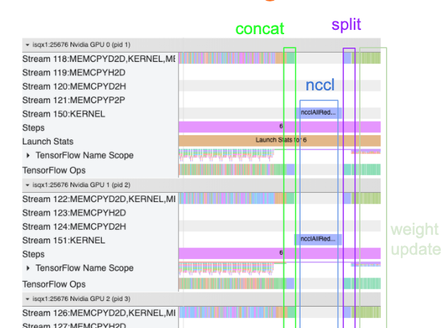

The following checklist will help you achieve better performance when optimizing
the performance in the multi-GPU scenario:

1.  Try to maximize the batch size, which will lead to higher device utilization
    and amortize the costs of communication across multiple GPUs. Using the
    [memory profiler](https://www.tensorflow.org/guide/profiler#memory_profile_summary)
    helps get a sense of how close your program is to peak memory utilization.
    Note that while a higher batch size can affect convergence, this is usually
    outweighed by the performance benefits.
2.  When moving from a single GPU to multiple GPUs, the same host now has to
    process much more input data. So, after (1), it is recommended to re-check
    the input pipeline performance and make sure it is not a bottleneck.
3.  Check the GPU timeline in your program's trace view for any unnecessary
    AllReduce calls, as this results in a synchronization across all devices. In
    the trace view shown above, the AllReduce is done via the
    [NCCL](https://developer.nvidia.com/nccl) kernel, and there is only one NCCL
    call on each GPU for the gradients on each step.
4.  Check for unnecessary D2H, H2D and D2D copy operations that can be
    minimized.
5.  Check the step time to make sure each replica is doing the same work. For
    example, it can happen that one GPU (typically, `GPU0`) is oversubscribed
    because the host mistakenly ends up putting more work on it.
6.  Lastly, check the training step across all GPUs in your trace view for any
    ops that are executing sequentially. This usually happens when your program
    includes control dependencies from one GPU to another. In the past,
    debugging the performance in this situation has been solved on a
    case-by-case basis. If you observe this behavior in your program,
    [file a GitHub issue](https://github.com/tensorflow/tensorflow/issues/new/choose)
    with images of your trace view.

### 1. Optimize gradient AllReduce

When training with a synchronous strategy, each device receives a portion of the
input data.

After computing the forward and backwards passes through the model, the
gradients calculated on each device need to be aggregated and reduced. This
_gradient AllReduce_ happens after the gradient calculation on each device, and
before the optimizer updates the model weights.

Each GPU first concatenates the gradients across the model layers, communicates
them across GPUs using `tf.distribute.CrossDeviceOps`
(`tf.distribute.NcclAllReduce` is the default), and then returns the gradients
after reduction per layer.

The optimizer will use these reduced gradients to update the weights of your
model. Ideally, this process should happen at the same time on all GPUs to
prevent any overheads.

The time to AllReduce should be approximately the same as:

```
(number of parameters * 4bytes)/ (communication bandwidth)
```

This calculation is useful as a quick check to understand whether the
performance you have when running a distributed training job is as expected, or
if you need to do further performance debugging. You can get the number of
parameters in your model from `Model.summary`.

Note that each model parameter is 4 bytes in size since TensorFlow uses `fp32`
(float32) to communicate gradients. Even when you have `fp16` enabled, NCCL
AllReduce utilizes `fp32` parameters.

To get the benefits of scaling, the step-time needs to be much higher compared
to these overheads. One way to achieve this is to use a higher batch size as
batch size affects step time, but does not impact the communication overhead.

### 2. GPU host thread contention

When running multiple GPUs, the CPU’s job is to keep all of the devices busy by
efficiently launching GPU kernels across the devices.

However, when there are a lot of independent operations that the CPU can
schedule on one GPU, the CPU can decide to use a lot of its host threads to keep
one GPU busy, and then launch kernels on another GPU in a non-deterministic
order. This can cause a skew or negative scaling, which can negatively affect
the performance.

The [trace viewer](https://www.tensorflow.org/guide/profiler#trace_viewer) below
shows the overhead when the CPU staggers GPU kernel launches inefficiently, as
`GPU1` is idle and then starts running ops after `GPU2` has started.

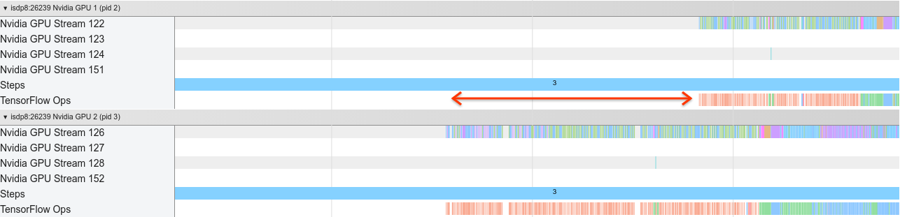

The trace view for the host shows that the host is launching kernels on `GPU2`
before launching them on `GPU1` (note that the below `tf_Compute*` ops are not
indicative of CPU threads).

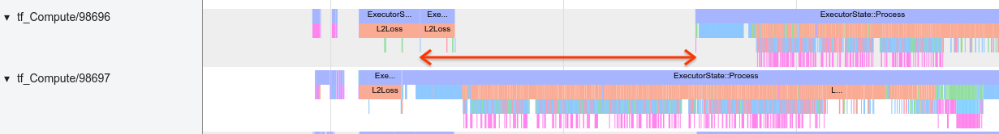

If you experience this kind of staggering of GPU kernels in your program’s trace
view, the recommended action is to:

-   Set the TensorFlow environment variable `TF_GPU_THREAD_MODE` to
    `gpu_private`. This environment variable will tell the host to keep threads
    for a GPU private.
-   By default,`TF_GPU_THREAD_MODE=gpu_private` sets the number of threads to 2,
    which is sufficient in most cases. However, that number can be changed by
    setting the TensorFlow environment variable `TF_GPU_THREAD_COUNT` to the
    desired number of threads.
