# Optimize TensorFlow performance using the Profiler

[TOC]

This guide demonstrates how to use the tools available with the TensorFlow
Profiler to track the performance of your TensorFlow models. You will learn how
to understand how your model performs on the host (CPU), the device (GPU), or on
a combination of both the host and device(s).

Profiling helps understand the hardware resource consumption (time and memory)
of the various TensorFlow operations (ops) in your model and resolve performance
bottlenecks and, ultimately, make the model execute faster.

This guide will walk you through how to install the Profiler, the various tools
available, the different modes of how the Profiler collects performance data,
and some recommended best practices to optimize model performance.

If you want to profile your model performance on Cloud TPUs, refer to the
[Cloud TPU guide](https://cloud.google.com/tpu/docs/cloud-tpu-tools#capture_profile).

## Install the Profiler and GPU prerequisites

Install the Profiler plugin for TensorBoard with pip. Note that the Profiler
requires the latest versions of TensorFlow and TensorBoard (>=2.2).

```shell
pip install -U tensorboard_plugin_profile
```

To profile on the GPU, you must:

1.  Meet the NVIDIA® GPU drivers and CUDA® Toolkit requirements listed on
    [TensorFlow GPU support software requirements](https://www.tensorflow.org/install/gpu#linux_setup).
2.  Make sure the
    [NVIDIA® CUDA® Profiling Tools Interface](https://developer.nvidia.com/cupti)
    (CUPTI) exists on the path:

    ```shell
    /sbin/ldconfig -N -v $(sed 's/:/ /g' <<< $LD_LIBRARY_PATH) | \
    grep libcupti
    ```

If you don't have CUPTI on the path, prepend its installation directory to the
`$LD_LIBRARY_PATH` environment variable by running:

```shell
export LD_LIBRARY_PATH=/usr/local/cuda/extras/CUPTI/lib64:$LD_LIBRARY_PATH
```

Then, run the `ldconfig` command above again to verify that the CUPTI library is
found.

### Resolve privilege issues

When you run profiling with CUDA® Toolkit in a Docker environment or on Linux,
you may encounter issues related to insufficient CUPTI privileges
(`CUPTI_ERROR_INSUFFICIENT_PRIVILEGES`). Go to the
[NVIDIA Developer Docs](https://developer.nvidia.com/nvidia-development-tools-solutions-ERR_NVGPUCTRPERM-permission-issue-performance-counters){:.external}
to learn more about how you can resolve these issues on Linux.

To resolve CUPTI privilege issues in a Docker environment, run

```shell
docker run option '--privileged=true'
```

<a name="profiler_tools"></a>

## Profiler tools

Access the Profiler from the **Profile** tab in TensorBoard, which appears only
after you have captured some model data.

Note: The Profiler requires internet access to load the
[Google Chart libraries](https://developers.google.com/chart/interactive/docs/basic_load_libs#basic-library-loading).
Some charts and tables may be missing if you run TensorBoard entirely offline on
your local machine, behind a corporate firewall, or in a data center.

The Profiler has a selection of tools to help with performance analysis:

-   Overview Page
-   Input Pipeline Analyzer
-   TensorFlow Stats
-   Trace Viewer
-   GPU Kernel Stats
-   Memory Profile Tool
-   Pod Viewer

<a name="overview_page"></a>

### Overview page

The overview page provides a top level view of how your model performed during a
profile run. The page shows you an aggregated overview page for your host and
all devices, and some recommendations to improve your model training
performance. You can also select individual hosts in the Host dropdown.

The overview page displays data as follows:

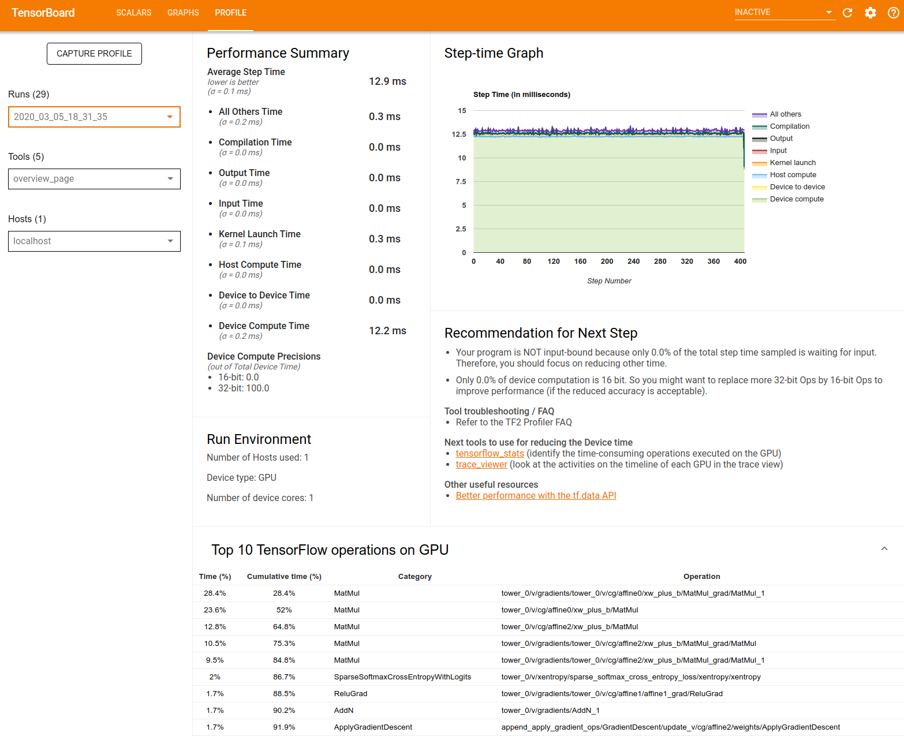

*   **Performance Summary**: Displays a high-level summary of your model
    performance. The performance summary has two parts:

    1.  Step-time breakdown: Breaks down the average step time into multiple
        categories of where time is spent:

        *   Compilation: Time spent compiling kernels.
        *   Input: Time spent reading input data.
        *   Output: Time spent reading output data.
        *   Kernel launch: Time spent by the host to launch kernels
        *   Host compute time..
        *   Device-to-device communication time.
        *   On-device compute time.
        *   All others, including Python overhead.

    2.  Device compute precisions - Reports the percentage of device compute
        time that uses 16 and 32-bit computations.

*   **Step-time Graph**: Displays a graph of device step time (in milliseconds)
    over all the steps sampled. Each step is broken into the multiple categories
    (with different colors) of where time is spent. The red area corresponds to
    the portion of the step time the devices were sitting idle waiting for input
    data from the host. The green area shows how much of time the device was
    actually working.

*   **Top 10 TensorFlow operations on device (e.g. GPU)**: Displays the
    on-device ops that ran the longest.

    Each row displays an op's self time (as the percentage of time taken by all
    ops), cumulative time, category, and name.

*   **Run Environment**: Displays a high-level summary of the model run
    environment including:

    *   Number of hosts used.
    *   Device type (GPU/TPU).
    *   Number of device cores.

*   **Recommendation for Next Step**: Reports when a model is input bound and
    recommends tools you can use to locate and resolve model performance
    bottlenecks.

<a name="input_pipeline_analyzer"></a>

### Input pipeline analyzer

When a TensorFlow program reads data from a file it begins at the top of the
TensorFlow graph in a pipelined manner. The read process is divided into
multiple data processing stages connected in series, where the output of one
stage is the input to the next one. This system of reading data is called the
*input pipeline*.

A typical pipeline for reading records from files has the following stages:

1.  File reading.
1.  File preprocessing (optional).
1.  File transfer from the host to the device.

An inefficient input pipeline can severely slow down your application. An
application is considered **input bound** when it spends a significant portion
of time in the input pipeline. Use the insights obtained from the input pipeline
analyzer to understand where the input pipeline is inefficient.

The input pipeline analyzer tells you immediately whether your program is input
bound and walks you through device- and host-side analysis to debug performance
bottlenecks at any stage in the input pipeline.

Check the guidance on input pipeline performance for recommended best practices
to optimize your data input pipelines.

#### Input pipeline dashboard

To open the input pipeline analyzer, select **Profile**, then select
**input_pipeline_analyzer** from the **Tools** dropdown.

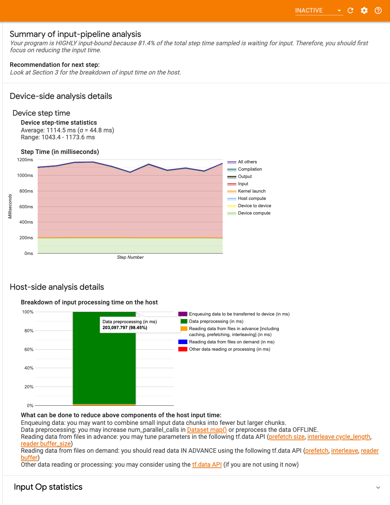

The dashboard contains three sections:

1.  **Summary**: Summarizes the overall input pipeline with information on
    whether your application is input bound and, if so, by how much.
1.  **Device-side analysis**: Displays detailed, device-side analysis results,
    including the device step-time and the range of device time spent waiting
    for input data across cores at each step.
1.  **Host-side analysis**: Shows a detailed analysis on the host side,
    including a breakdown of input processing time on the host.

#### Input pipeline summary

The **Summary** reports if your program is input bound by presenting the
percentage of device time spent on waiting for input from the host. If you are
using a standard input pipeline that has been instrumented, the tool reports
where most of the input processing time is spent.

#### Device-side analysis

The device-side analysis provides insights on time spent on the device versus on
the host and how much device time was spent waiting for input data from the
host.

1.  **Step time plotted against step number**: Displays a graph of device step
    time (in milliseconds) over all the steps sampled. Each step is broken into
    the multiple categories (with different colors) of where time is spent. The
    red area corresponds to the portion of the step time the devices were
    sitting idle waiting for input data from the host. The green area shows how
    much of the time the device was actually working.
1.  **Step time statistics**: Reports the average, standard deviation, and range
    (\[minimum, maximum\]) of the device step time.

#### Host-side analysis

The host-side analysis reports a breakdown of the input processing time (the
time spent on `tf.data` API ops) on the host into several categories:

-   **Reading data from files on demand**: Time spent on reading data from files
    without caching, prefetching, and interleaving.
-   **Reading data from files in advance**: Time spent reading files, including
    caching, prefetching, and interleaving.
-   **Data preprocessing**: Time spent on preprocessing ops, such as image
    decompression.
-   **Enqueuing data to be transferred to device**: Time spent putting data into
    an infeed queue before transferring the data to the device.

Expand **Input Op Statistics** to inspect the statistics for individual input
ops and their categories broken down by execution time.

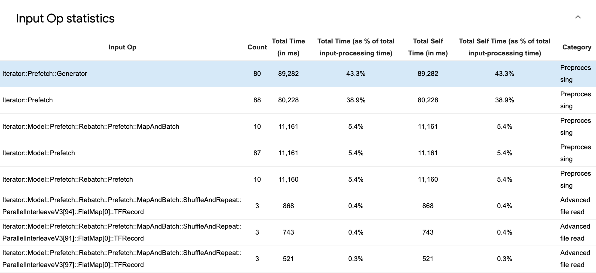

A source data table will appear with each entry containing the following
information:

1.  **Input Op**: Shows the TensorFlow op name of the input op.
1.  **Count**: Shows the total number of instances of op execution during the
    profiling period.
1.  **Total Time (in ms)**: Shows the cumulative sum of time spent on each of
    those instances.
1.  **Total Time %**: Shows the total time spent on an op as a fraction of the
    total time spent in input processing.
1.  **Total Self Time (in ms)**: Shows the cumulative sum of the self time spent
    on each of those instances. The self time here measures the time spent
    inside the function body, excluding the time spent in the function it calls.
1.  **Total Self Time %**. Shows the total self time as a fraction of the total
    time spent on input processing.
1.  **Category**. Shows the processing category of the input op.

<a name="tf_stats"></a>

### TensorFlow stats

The TensorFlow Stats tool displays the performance of every TensorFlow op (op)
that is executed on the host or device during a profiling session.

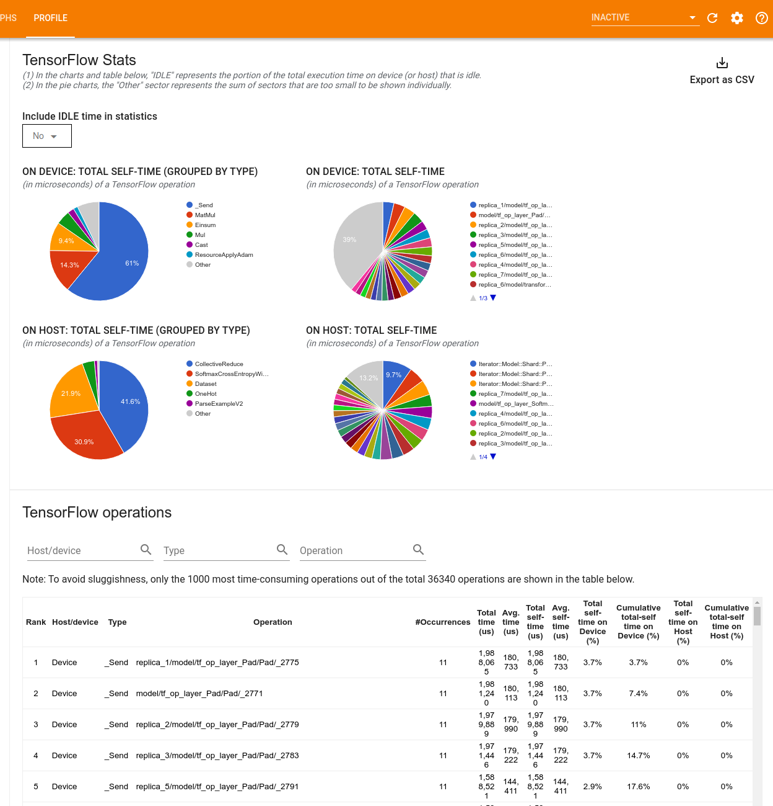

The tool displays performance information in two panes:

-   The upper pane displays up to four pie charts:

    1.  The distribution of self-execution time of each op on the host.
    1.  The distribution of self-execution time of each op type on the host.
    1.  The distribution of self-execution time of each op on the device.
    1.  The distribution of self-execution time of each op type on the device.

-   The lower pane shows a table that reports data about TensorFlow ops with one
    row for each op and one column for each type of data (sort columns by
    clicking the heading of the column). Click the **Export as CSV button** on
    the right side of the upper pane to export the data from this table as a CSV
    file.

    Note that:

    *   If any ops have child ops:

        *   The total "accumulated" time of an op includes the time spent inside
            the child ops.
        *   The total "self" time of an op does not include the time spent
            inside the child ops.

    *   If an op executes on the host:

        *   The percentage of the total self-time on device incurred by the op
            on will be 0.
        *   The cumulative percentage of the total self-time on device up to and
            including this op will be 0.

    *   If an op executes on the device:

        *   The percentage of the total self-time on host incurred by this op
            will be 0.
        *   The cumulative percentage of the total self-time on host up to and
            including this op will be 0.

You can choose to include or exclude Idle time in the pie charts and table.

<a name="trace_viewer"></a>

### Trace viewer

The trace viewer displays a timeline that shows:

-   Durations for the ops that were executed by your TensorFlow model
-   Which part of the system (host or device) executed an op. Typically, the
    host executes input operations, preprocesses training data and transfers it
    to the device, while the device executes the actual model training

The trace viewer allows you to identify performance problems in your model, then
take steps to resolve them. For example, at a high level, you can identify
whether input or model training is taking the majority of the time. Drilling
down, you can identify which ops take the longest to execute. Note that the
trace viewer is limited to 1 million events per device.

#### Trace viewer interface

When you open the trace viewer, it appears displaying your most recent run:

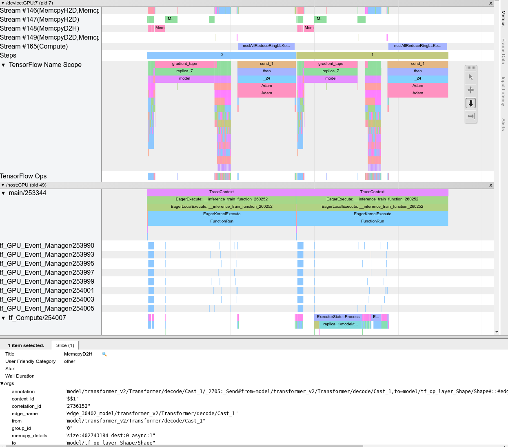

This screen contains the following main elements:

1.  **Timeline pane**: Shows ops that the device and the host executed over
    time.
1.  **Details pane**: Shows additional information for ops selected in the
    Timeline pane.

The Timeline pane contains the following elements:

1.  **Top bar**: Contains various auxiliary controls.
1.  **Time axis**: Shows time relative to the beginning of the trace.
1.  **Section and track labels**: Each section contains multiple tracks and has
    a triangle on the left that you can click to expand and collapse the
    section. There is one section for every processing element in the system.
1.  **Tool selector**: Contains various tools for interacting with the trace
    viewer such as Zoom, Pan, Select, and Timing. Use the Timing tool to mark a
    time interval.
1.  **Events**: These show the time during which an op was executed or the
    duration of meta-events, such as training steps.

##### Sections and tracks

The trace viewer contains the following sections:

-   **One section for each device node**, labeled with the number of the device
    chip and the device node within the chip (for example, `/device:GPU:0 (pid
    0)`). Each device node section contains the following tracks:
    -   **Step**: Shows the duration of the training steps that were running on
        the device
    -   **TensorFlow Ops**: Shows the ops executed on the device
    -   **XLA Ops**: Shows [XLA](https://www.tensorflow.org/xla/) operations
        (ops) that ran on the device if XLA is the compiler used (each
        TensorFlow op is translated into one or several XLA ops. The XLA
        compiler translates the XLA ops into code that runs on the device).
-   **One section for threads running on the host machine's CPU,** labeled
    **"Host Threads"**. The section contains one track for each CPU thread. Note
    that you can ignore the information displayed alongside the section labels.

##### Events

Events within the timeline are displayed in different colors; the colors
themselves have no specific meaning.

The trace viewer can also display traces of Python function calls in your
TensorFlow program. If you use the `tf.profiler.experimental.start` API, you can
enable Python tracing by using the `ProfilerOptions` namedtuple when starting
profiling. Alternatively, if you use the sampling mode for profiling, you can
select the level of tracing by using the dropdown options in the **Capture
Profile** dialog.

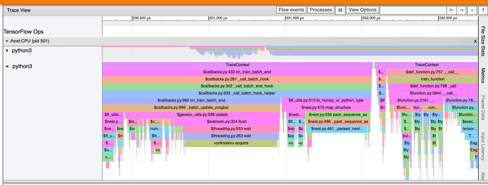

<a name="gpu_kernel_stats"></a>

### GPU kernel stats

This tool shows performance statistics and the originating op for every GPU
accelerated kernel.

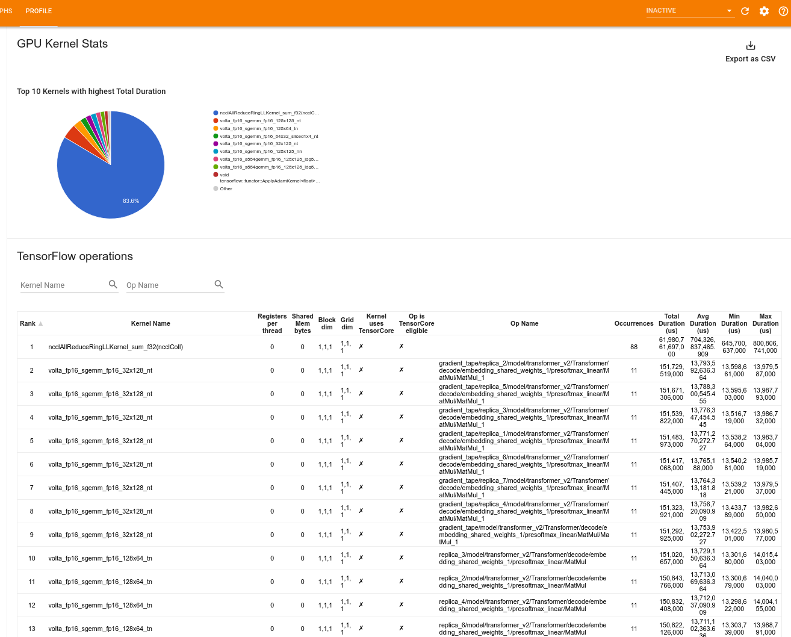

The tool displays information in two panes:

-   The upper pane displays a pie chart which shows the CUDA kernels that have
    the highest total time elapsed.

-   The lower pane displays a table with the following data for each unique
    kernel-op pair:

    *   A rank in descending order of total elapsed GPU duration grouped by
        kernel-op pair.
    *   The name of the launched kernel.
    *   The number of GPU registers used by the kernel.
    *   The total size of shared (static + dynamic shared) memory used in bytes.
    *   The block dimension expressed as `blockDim.x, blockDim.y, blockDim.z`.
    *   The grid dimensions expressed as `gridDim.x, gridDim.y, gridDim.z`.
    *   Whether the op is eligible to use
        [Tensor Cores](https://www.nvidia.com/en-gb/data-center/tensor-cores/).
    *   Whether the kernel contains Tensor Core instructions.
    *   The name of the op that launched this kernel.
    *   The number of occurrences of this kernel-op pair.
    *   The total elapsed GPU time in microseconds.
    *   The average elapsed GPU time in microseconds.
    *   The minimum elapsed GPU time in microseconds.
    *   The maximum elapsed GPU time in microseconds.

<a name="memory_profile_tool"></a>

### Memory profile tool {: id = 'memory_profile_tool'}

The **Memory Profile** tool monitors the memory usage of your device during the
profiling interval. You can use this tool to:

*   Debug out of memory (OOM) issues by pinpointing peak memory usage and the
    corresponding memory allocation to TensorFlow ops. You can also debug OOM
    issues that may arise when you run
    [multi-tenancy](https://arxiv.org/pdf/1901.06887.pdf) inference.
*   Debug memory fragmentation issues.

The memory profile tool displays data in three sections:

1.  **Memory Profile Summary**
1.  **Memory Timeline Graph**
1.  **Memory Breakdown Table**

#### Memory profile summary

This section displays a high-level summary of the memory profile of your
TensorFlow program as shown below:

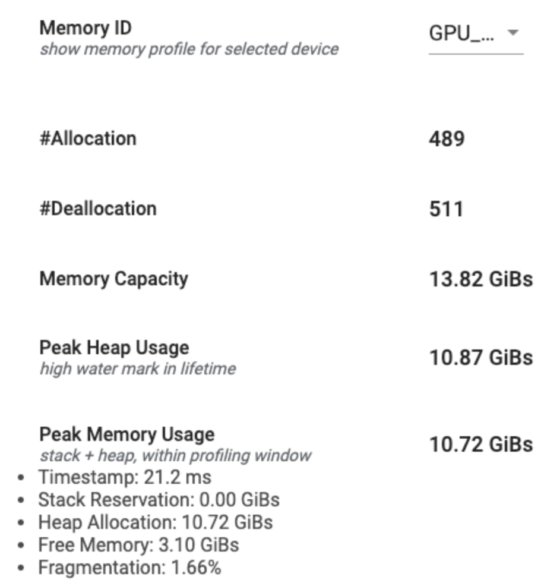

The memory profile summary has six fields:

1.  **Memory ID**: Dropdown which lists all available device memory systems.
    Select the memory system you want to view from the dropdown.
1.  **#Allocation**: The number of memory allocations made during the profiling
    interval.
1.  **#Deallocation**: The number of memory deallocations in the profiling
    interval
1.  **Memory Capacity**: The total capacity (in GiBs) of the memory system that
    you select.
1.  **Peak Heap Usage**: The peak memory usage (in GiBs) since the model started
    running.
1.  **Peak Memory Usage**: The peak memory usage (in GiBs) in the profiling
    interval. This field contains the following sub-fields:
    1.  **Timestamp**: The timestamp of when the peak memory usage occurred on
        the Timeline Graph.
    1.  **Stack Reservation**: Amount of memory reserved on the stack (in GiBs).
    1.  **Heap Allocation**: Amount of memory allocated on the heap (in GiBs).
    1.  **Free Memory**: Amount of free memory (in GiBs). The Memory Capacity is
        the sum total of the Stack Reservation, Heap Allocation, and Free
        Memory.
    1.  **Fragmentation**: The percentage of fragmentation (lower is better). It
        is calculated as a percentage of `(1 - Size of the largest chunk of free
        memory / Total free memory)`.

#### Memory timeline graph

This section displays a plot of the memory usage (in GiBs) and the percentage of
fragmentation versus time (in ms).

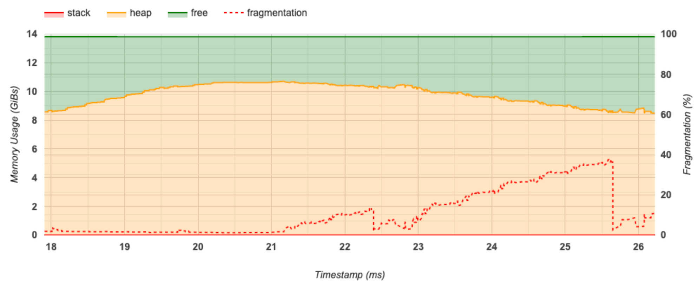

The X-axis represents the timeline (in ms) of the profiling interval. The Y-axis
on the left represents the memory usage (in GiBs) and the Y-axis on the right
represents the percentage of fragmentation. At each point in time on the X-axis,
the total memory is broken down into three categories: stack (in red), heap (in
orange), and free (in green). Hover over a specific timestamp to view the
details about the memory allocation/deallocation events at that point like
below:

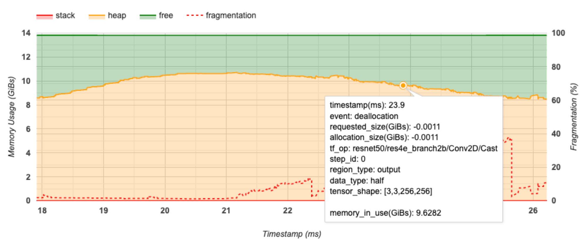

The pop-up window displays the following information:

*   **timestamp(ms)**: The location of the selected event on the timeline.
*   **event**: The type of event (allocation or deallocation).
*   **requested_size(GiBs)**: The amount of memory requested. This will be a
    negative number for deallocation events.
*   **allocation_size(GiBs)**: The actual amount of memory allocated. This will
    be a negative number for deallocation events.
*   **tf_op**: The TensorFlow op that requests the allocation/deallocation.
*   **step_id**: The training step in which this event occurred.
*   **region_type**: The data entity type that this allocated memory is for.
    Possible values are `temp` for temporaries, `output` for activations and
    gradients, and `persist`/`dynamic` for weights and constants.
*   **data_type**: The tensor element type (e.g., uint8 for 8-bit unsigned
    integer).
*   **tensor_shape**: The shape of the tensor being allocated/deallocated.
*   **memory_in_use(GiBs)**: The total memory that is in use at this point of
    time.

#### Memory breakdown table

This table shows the active memory allocations at the point of peak memory usage
in the profiling interval.

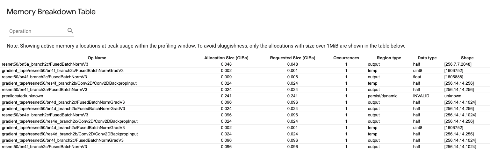

There is one row for each TensorFlow Op and each row has the following columns:

*   **Op Name**: The name of the TensorFlow op.
*   **Allocation Size (GiBs)**: The total amount of memory allocated to this op.
*   **Requested Size (GiBs)**: The total amount of memory requested for this op.
*   **Occurrences**: The number of allocations for this op.
*   **Region type**: The data entity type that this allocated memory is for.
    Possible values are `temp` for temporaries, `output` for activations and
    gradients, and `persist`/`dynamic` for weights and constants.
*   **Data type**: The tensor element type.
*   **Shape**: The shape of the allocated tensors.

Note: You can sort any column in the table and also filter rows by op name.

<a name="pod_viewer"></a>

### Pod viewer

The Pod Viewer tool shows the breakdown of a training step across all workers.

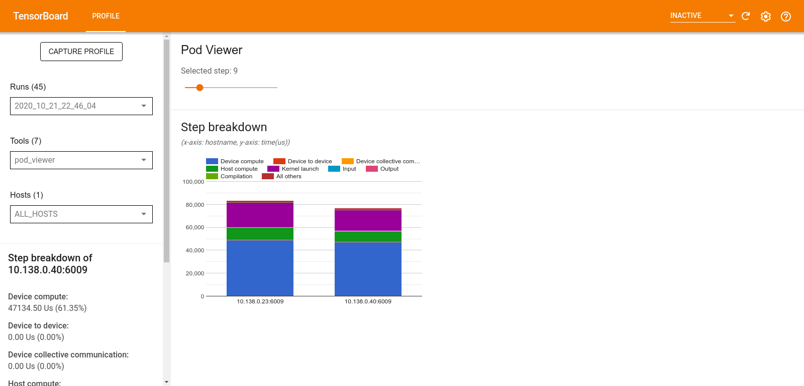

-   The upper pane has a slider for selecting the step number.
-   The lower pane displays a stacked column chart. This is a high level view of
    broken down step-time categories placed atop one another. Each stacked
    column represents a unique worker.
-   When you hover over a stacked column, the card on the left-hand side shows
    more details about the step breakdown.

<a name="tf_data_bottleneck_analysis"></a>

### tf.data bottleneck analysis

Warning: This tool is experimental. Please open a
[GitHub Issue](https://github.com/tensorflow/profiler/issues) if the analysis
result seems incorrect.

The `tf.data` bottleneck analysis tool automatically detects bottlenecks in
`tf.data` input pipelines in your program and provides recommendations on how to
fix them. It works with any program using `tf.data` regardless of the platform
(CPU/GPU/TPU). Its analysis and recommendations are based on this
[guide](https://www.tensorflow.org/guide/data_performance_analysis).

It detects a bottleneck by following these steps:

1.  Find the most input bound host.
1.  Find the slowest execution of a `tf.data` input pipeline.
1.  Reconstruct the input pipeline graph from the profiler trace.
1.  Find the critical path in the input pipeline graph.
1.  Identify the slowest transformation on the critical path as a bottleneck.

The UI is divided into three sections: **Performance Analysis Summary**,
**Summary of All Input Pipelines** and **Input Pipeline Graph**.

#### Performance analysis summary

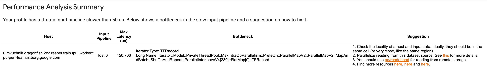

This section provides the summary of the analysis. It reports on slow `tf.data`
input pipelines detected in the profile. This section also shows the most input
bound host and its slowest input pipeline with the max latency. Most
importantly, it identifies which part of the input pipeline is the bottleneck
and how to fix it. The bottleneck information is provided with the iterator type
and its long name.

##### How to read tf.data iterator's long name

A long name is formatted as `Iterator::<Dataset_1>::...::<Dataset_n>`. In the
long name, `<Dataset_n>` matches the iterator type and the other datasets in the
long name represent downstream transformations.

For example, consider the following input pipeline dataset:

```python
dataset = tf.data.Dataset.range(10).map(lambda x: x).repeat(2).batch(5)
```

The long names for the iterators from the above dataset will be:

Iterator Type | Long Name
:------------ | :----------------------------------
Range         | Iterator::Batch::Repeat::Map::Range
Map           | Iterator::Batch::Repeat::Map
Repeat        | Iterator::Batch::Repeat
Batch         | Iterator::Batch

#### Summary of all input pipelines

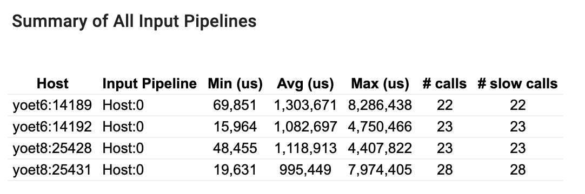

This section provides the summary of all input pipelines across all hosts.
Typically there is one input pipeline. When using the distribution strategy,
there is one host input pipeline running the program's `tf.data` code and
multiple device input pipelines retrieving data from the host input pipeline and
transferring it to the devices.

For each input pipeline, it shows the statistics of its execution time. A call
is counted as slow if it takes longer than 50 μs.

#### Input pipeline graph

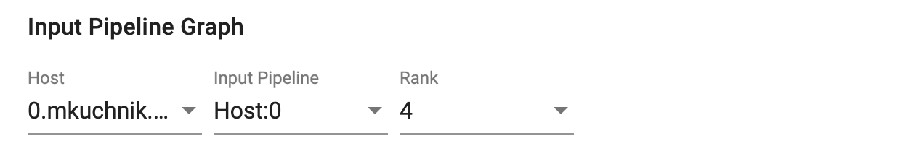

This section shows the input pipeline graph with the execution time information.
You can use "Host" and "Input Pipeline" to choose which host and input pipeline
to see. Executions of the input pipeline are sorted by the execution time in
descending order which you can choose using the **Rank** dropdown.

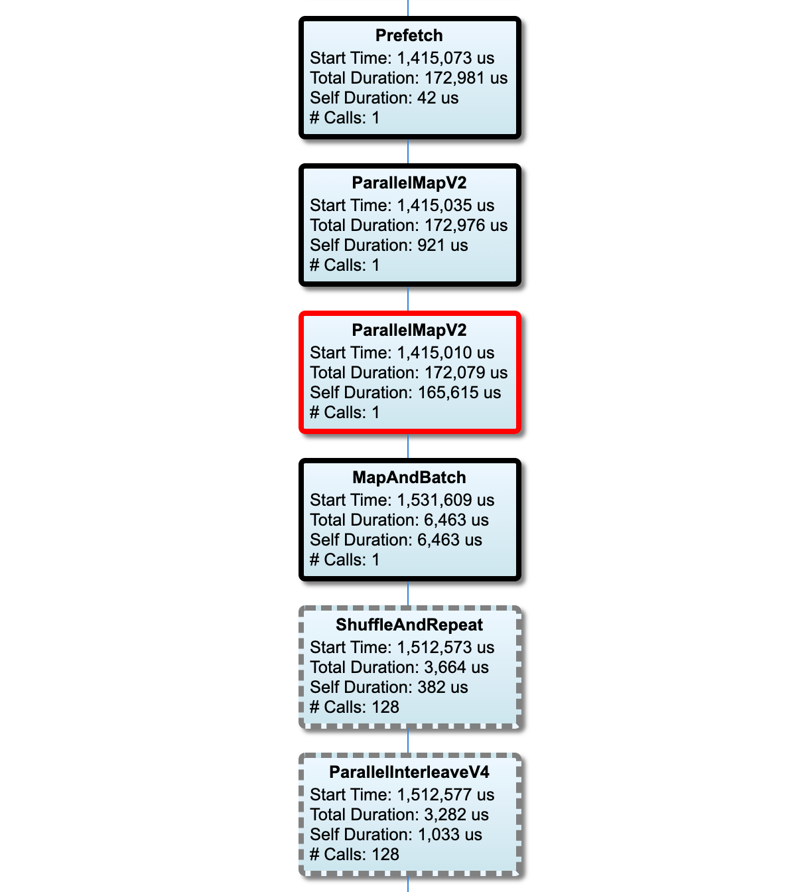

The nodes on the critical path have bold outlines. The bottleneck node, which is
the node with the longest self time on the critical path, has a red outline. The
other non-critical nodes have gray dashed outlines.

In each node,**Start Time** indicates the start time of the execution. The same
node may be executed multiple times, for example, if there is a `Batch` op in
the input pipeline. If it is executed multiple times, it is the start time of
the first execution.

**Total Duration** is the wall time of the execution. If it is executed multiple
times, it is the sum of the wall times of all executions.

**Self Time** is **Total Time** without the overlapped time with its immediate
child nodes.

"# Calls" is the number of times the input pipeline is executed.

<a name="collect_performance_data"></a>

## Collect performance data

The TensorFlow Profiler collects host activities and GPU traces of your
TensorFlow model. You can configure the Profiler to collect performance data
through either the programmatic mode or the sampling mode.

### Profiling APIs

You can use the following APIs to perform profiling.

*   Programmatic mode using the TensorBoard Keras Callback
    (`tf.keras.callbacks.TensorBoard`)

    ```python
    # Profile from batches 10 to 15
    tb_callback = tf.keras.callbacks.TensorBoard(log_dir=log_dir,
                                                 profile_batch='10, 15')

    # Train the model and use the TensorBoard Keras callback to collect
    # performance profiling data
    model.fit(train_data,
              steps_per_epoch=20,
              epochs=5,
              callbacks=[tb_callback])
    ```

*   Programmatic mode using the `tf.profiler` Function API

    ```python
    tf.profiler.experimental.start('logdir')
    # Train the model here
    tf.profiler.experimental.stop()
    ```

*   Programmatic mode using the context manager

    ```python
    with tf.profiler.experimental.Profile('logdir'):
        # Train the model here
        pass
    ```

Note: Running the Profiler for too long can cause it to run out of memory. It is
recommended to profile no more than 10 steps at a time. Avoid profiling the
first few batches to avoid inaccuracies due to initialization overhead.

<a name="sampling_mode"></a>

*   Sampling mode: Perform on-demand profiling by using
    `tf.profiler.experimental.server.start` to start a gRPC server with your
    TensorFlow model run. After starting the gRPC server and running your model,
    you can capture a profile through the **Capture Profile** button in the
    TensorBoard profile plugin. Use the script in the Install profiler section
    above to launch a TensorBoard instance if it is not already running.

    As an example,

    ```python
    # Start a profiler server before your model runs.
    tf.profiler.experimental.server.start(6009)
    # (Model code goes here).
    #  Send a request to the profiler server to collect a trace of your model.
    tf.profiler.experimental.client.trace('grpc://localhost:6009',
                                          'gs://your_tb_logdir', 2000)
    ```

    An example for profiling multiple workers:

    ```python
    # E.g. your worker IP addresses are 10.0.0.2, 10.0.0.3, 10.0.0.4, and you
    # would like to profile for a duration of 2 seconds.
    tf.profiler.experimental.client.trace(
        'grpc://10.0.0.2:8466,grpc://10.0.0.3:8466,grpc://10.0.0.4:8466',
        'gs://your_tb_logdir',
        2000)
    ```

<a name="capture_dialog"></a>


Use the **Capture Profile** dialog to specify:

*   A comma-delimited list of profile service URLs or TPU names.
*   A profiling duration.
*   The level of device, host, and Python function call tracing.
*   How many times you want the Profiler to retry capturing profiles if
    unsuccessful at first.

### Profiling custom training loops

To profile custom training loops in your TensorFlow code, instrument the
training loop with the `tf.profiler.experimental.Trace` API to mark the step
boundaries for the Profiler.

The `name` argument is used as a prefix for the step names, the `step_num`
keyword argument is appended in the step names, and the `_r` keyword argument
makes this trace event get processed as a step event by the Profiler.

As an example,

```python
for step in range(NUM_STEPS):
    with tf.profiler.experimental.Trace('train', step_num=step, _r=1):
        train_data = next(dataset)
        train_step(train_data)
```

This will enable the Profiler's step-based performance analysis and cause the
step events to show up in the trace viewer.

Make sure that you include the dataset iterator within the
`tf.profiler.experimental.Trace` context for accurate analysis of the input
pipeline.

The code snippet below is an anti-pattern:

Warning: This will result in inaccurate analysis of the input pipeline.

```python
for step, train_data in enumerate(dataset):
    with tf.profiler.experimental.Trace('train', step_num=step, _r=1):
        train_step(train_data)
```

### Profiling use cases

The profiler covers a number of use cases along four different axes. Some of the
combinations are currently supported and others will be added in the future.
Some of the use cases are:

*   _Local vs. remote profiling_: These are two common ways of setting up your
    profiling environment. In local profiling, the profiling API is called on
    the same machine your model is executing, for example, a local workstation
    with GPUs. In remote profiling, the profiling API is called on a different
    machine from where your model is executing, for example, on a Cloud TPU.
*   _Profiling multiple workers_: You can profile multiple machines when using
    the distributed training capabilities of TensorFlow.
*   _Hardware platform_: Profile CPUs, GPUs, and TPUs.

The table below provides a quick overview of the TensorFlow-supported use cases
mentioned above:

<a name="profiling_api_table"></a>

| Profiling API                | Local     | Remote    | Multiple  | Hardware  |
:                              :           :           : workers   : Platforms :
| :--------------------------- | :-------- | :-------- | :-------- | :-------- |
| **TensorBoard Keras          | Supported | Not       | Not       | CPU, GPU  |
: Callback**                   :           : Supported : Supported :           :
| **`tf.profiler.experimental` | Supported | Not       | Not       | CPU, GPU  |
: start/stop [API][API_0]**    :           : Supported : Supported :           :
| **`tf.profiler.experimental` | Supported | Supported | Supported | CPU, GPU, |
: client.trace [API][API_1]**  :           :           :           : TPU       :
| **Context manager API**      | Supported | Not       | Not       | CPU, GPU  |
:                              :           : supported : Supported :           :

[API_0]: https://www.tensorflow.org/api_docs/python/tf/profiler/experimental#functions_2
[API_1]: https://www.tensorflow.org/api_docs/python/tf/profiler/experimental/client/trace

<a name="performance_best_practices"></a>

## Best practices for optimal model performance

Use the following recommendations as applicable for your TensorFlow models to
achieve optimal performance.

In general, perform all transformations on the device and ensure that you use
the latest compatible version of libraries like cuDNN and Intel MKL for your
platform.

### Optimize the input data pipeline

Use the data from the [#input_pipeline_analyzer] to optimize your data input
pipeline. An efficient data input pipeline can drastically improve the speed of
your model execution by reducing device idle time. Try to incorporate the best
practices detailed in the
[Better performance with the tf.data API](https://www.tensorflow.org/guide/data_performance)
guide and below to make your data input pipeline more efficient.

*   In general, parallelizing any ops that do not need to be executed
    sequentially can significantly optimize the data input pipeline.

*   In many cases, it helps to change the order of some calls or to tune the
    arguments such that it works best for your model. While optimizing the input
    data pipeline, benchmark only the data loader without the training and
    backpropagation steps to quantify the effect of the optimizations
    independently.

*   Try running your model with synthetic data to check if the input pipeline is
    a performance bottleneck.

*   Use `tf.data.Dataset.shard` for multi-GPU training. Ensure you shard very
    early on in the input loop to prevent reductions in throughput. When working
    with TFRecords, ensure you shard the list of TFRecords and not the contents
    of the TFRecords.

*   Parallelize several ops by dynamically setting the value of
    `num_parallel_calls` using `tf.data.AUTOTUNE`.

*   Consider limiting the usage of `tf.data.Dataset.from_generator` as it is
    slower compared to pure TensorFlow ops.

*   Consider limiting the usage of `tf.py_function` as it cannot be serialized
    and is not supported to run in distributed TensorFlow.

*   Use `tf.data.Options` to control static optimizations to the input pipeline.

Also read the `tf.data` performance analysis
[guide](https://www.tensorflow.org/guide/data_performance_analysis) for more
guidance on optimizing your input pipeline.

#### Optimize data augmentation

When working with image data, make your
[data augmentation](https://www.tensorflow.org/tutorials/images/data_augmentation)
more efficient by casting to different data types <b><i>after</i></b> applying
spatial transformations, such as flipping, cropping, rotating, etc.

Note: Some ops like `tf.image.resize` transparently change the `dtype` to
`fp32`. Make sure you normalize your data to lie between `0` and `1` if its not
done automatically. Skipping this step could lead to `NaN` errors if you have
enabled [AMP](https://developer.nvidia.com/automatic-mixed-precision).

#### Use NVIDIA® DALI

In some instances, such as when you have a system with a high GPU to CPU ratio,
all of the above optimizations may not be enough to eliminate bottlenecks in the
data loader caused due to limitations of CPU cycles.

If you are using NVIDIA® GPUs for computer vision and audio deep learning
applications, consider using the Data Loading Library
([DALI](https://docs.nvidia.com/deeplearning/dali/user-guide/docs/examples/getting%20started.html))
to accelerate the data pipeline.

Check the
[NVIDIA® DALI: Operations](https://docs.nvidia.com/deeplearning/dali/user-guide/docs/supported_ops.html)
documentation for a list of supported DALI ops.

### Use threading and parallel execution

Run ops on multiple CPU threads with the `tf.config.threading` API to execute
them faster.

TensorFlow automatically sets the number of parallelism threads by default. The
thread pool available for running TensorFlow ops depends on the number of CPU
threads available.

Control the maximum parallel speedup for a single op by using
`tf.config.threading.set_intra_op_parallelism_threads`. Note that if you run
multiple ops in parallel, they will all share the available thread pool.

If you have independent non-blocking ops (ops with no directed path between them
on the graph), use `tf.config.threading.set_inter_op_parallelism_threads` to run
them concurrently using the available thread pool.

### Miscellaneous

When working with smaller models on NVIDIA® GPUs, you can set
`tf.compat.v1.ConfigProto.force_gpu_compatible=True` to force all CPU tensors to
be allocated with CUDA pinned memory to give a significant boost to model
performance. However, exercise caution while using this option for unknown/very
large models as this might negatively impact the host (CPU) performance.

### Improve device performance

Follow the best practices detailed here and in the
[GPU performance optimization guide](https://www.tensorflow.org/guide/gpu_performance_analysis)
to optimize on-device TensorFlow model performance.

If you are using NVIDIA GPUs, log the GPU and memory utilization to a CSV file
by running:

```shell
nvidia-smi
--query-gpu=utilization.gpu,utilization.memory,memory.total,
memory.free,memory.used --format=csv
```

#### Configure data layout

When working with data that contains channel information (like images), optimize
the data layout format to prefer channels last (NHWC over NCHW).

Channel-last data formats improve
[Tensor Core](https://www.nvidia.com/en-gb/data-center/tensor-cores/)
utilization and provide significant performance improvements especially in
convolutional models when coupled with AMP. NCHW data layouts can still be
operated on by Tensor Cores, but introduce additional overhead due to automatic
transpose ops.

You can optimize the data layout to prefer NHWC layouts by setting
`data_format="channels_last"` for layers such as `tf.keras.layers.Conv2D`,
`tf.keras.layers.Conv3D`, and
`tf.keras.layers.experimental.preprocessing.RandomRotation`.

Use `tf.keras.backend.set_image_data_format` to set the default data layout
format for the Keras backend API.

#### Max out the L2 cache

When working with NVIDIA® GPUs, execute the code snippet below before the
training loop to max out the L2 fetch granularity to 128 bytes.

```python
import ctypes

_libcudart = ctypes.CDLL('libcudart.so')
# Set device limit on the current device
# cudaLimitMaxL2FetchGranularity = 0x05
pValue = ctypes.cast((ctypes.c_int*1)(), ctypes.POINTER(ctypes.c_int))
_libcudart.cudaDeviceSetLimit(ctypes.c_int(0x05), ctypes.c_int(128))
_libcudart.cudaDeviceGetLimit(pValue, ctypes.c_int(0x05))
assert pValue.contents.value == 128
```

#### Configure GPU thread usage

The GPU thread mode decides how GPU threads are used.

Set the thread mode to `gpu_private` to make sure that preprocessing does not
steal all the GPU threads. This will reduce the kernel launch delay during
training. You can also set the number of threads per GPU. Set these values using
environment variables.

```python
import os

os.environ['TF_GPU_THREAD_MODE']='gpu_private'
os.environ['TF_GPU_THREAD_COUNT']='1'
```

#### Configure GPU memory options

In general, increase the batch size and scale the model to better utilize GPUs
and get higher throughput. Note that increasing the batch size will change the
model’s accuracy so the model needs to be scaled by tuning hyperparameters like
the learning rate to meet the target accuracy.

Also, use `tf.config.experimental.set_memory_growth` to allow GPU memory to grow
to prevent all the available memory from being fully allocated to ops that
require only a fraction of the memory. This allows other processes which consume
GPU memory to run on the same device.

To learn more, check out the
[Limiting GPU memory growth](https://www.tensorflow.org/guide/gpu#limiting_gpu_memory_growth)
guidance in the GPU guide to learn more.

#### Miscellaneous

*   Increase the training mini-batch size (number of training samples used per
    device in one iteration of the training loop) to the maximum amount that
    fits without an out of memory (OOM) error on the GPU. Increasing the batch
    size impacts the model's accuracy—so make sure you scale the model by tuning
    hyperparameters to meet the target accuracy.

*   Disable reporting OOM errors during tensor allocation in production code.
    Set `report_tensor_allocations_upon_oom=False` in `tf.compat.v1.RunOptions`.

*   For models with convolution layers, remove bias addition if using batch
    normalization. Batch normalization shifts values by their mean and this
    removes the need to have a constant bias term.

*   Use TF Stats to find out how efficiently on-device ops run.

*   Use `tf.function` to perform computations and optionally, enable the
    `jit_compile=True` flag (`tf.function(jit_compile=True`). To learn more, go
    to
    [Use XLA tf.function](https://www.tensorflow.org/xla/tutorials/jit_compile).

*   Minimize host Python operations between steps and reduce callbacks.
    Calculate metrics every few steps instead of at every step.

*   Keep the device compute units busy.

*   Send data to multiple devices in parallel.

*   Consider
    [using 16-bit numerical representations](https://www.tensorflow.org/guide/mixed_precision),
    such as `fp16`—the half-precision floating point format specified by IEEE—or
    the Brain floating-point
    [bfloat16](https://cloud.google.com/tpu/docs/bfloat16) format.

## Additional resources

-   The
    [TensorFlow Profiler: Profile model performance](https://www.tensorflow.org/tensorboard/tensorboard_profiling_keras)
    tutorial with Keras and TensorBoard where you can apply the advice in this
    guide.
-   The
    [Performance profiling in TensorFlow 2](https://www.youtube.com/watch?v=pXHAQIhhMhI)
    talk from the TensorFlow Dev Summit 2020.
-   The [TensorFlow Profiler demo](https://www.youtube.com/watch?v=e4_4D7uNvf8)
    from the TensorFlow Dev Summit 2020.

## Known limitations

### Profiling multiple GPUs on TensorFlow 2.2 and TensorFlow 2.3

TensorFlow 2.2 and 2.3 support multiple GPU profiling for single host systems
only; multiple GPU profiling for multi-host systems is not supported. To profile
multi-worker GPU configurations, each worker has to be profiled independently.
From TensorFlow 2.4 multiple workers can be profiled using the
`tf.profiler.experimental.client.trace` API.

CUDA® Toolkit 10.2 or later is required to profile multiple GPUs. As TensorFlow
2.2 and 2.3 support CUDA® Toolkit versions only up to 10.1, you need to create
symbolic links to `libcudart.so.10.1` and `libcupti.so.10.1`:

```shell
sudo ln -s /usr/local/cuda/lib64/libcudart.so.10.2 /usr/local/cuda/lib64/libcudart.so.10.1
sudo ln -s /usr/local/cuda/extras/CUPTI/lib64/libcupti.so.10.2 /usr/local/cuda/extras/CUPTI/lib64/libcupti.so.10.1
```
