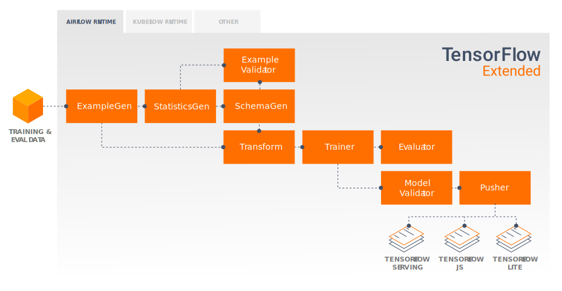
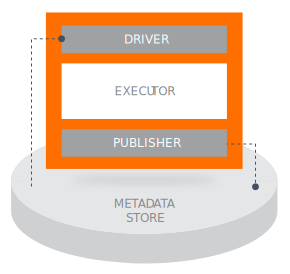
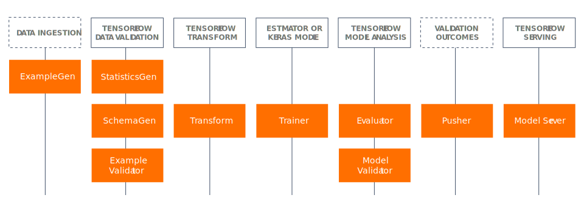
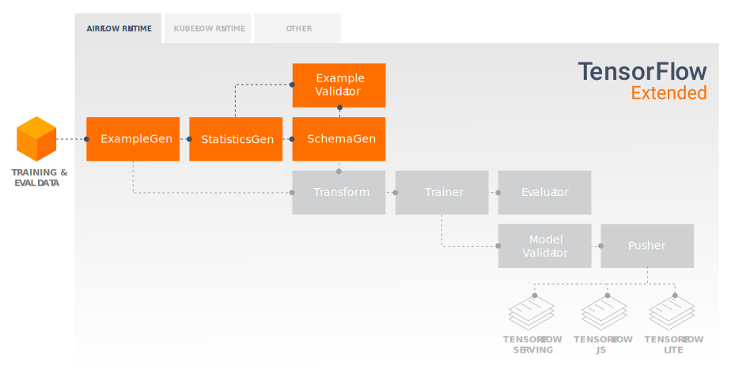
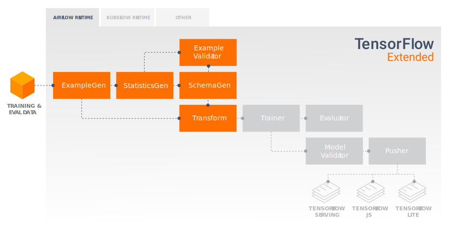
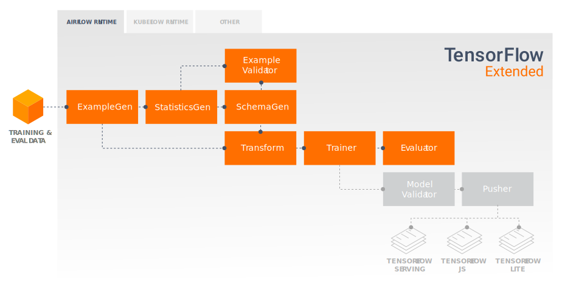
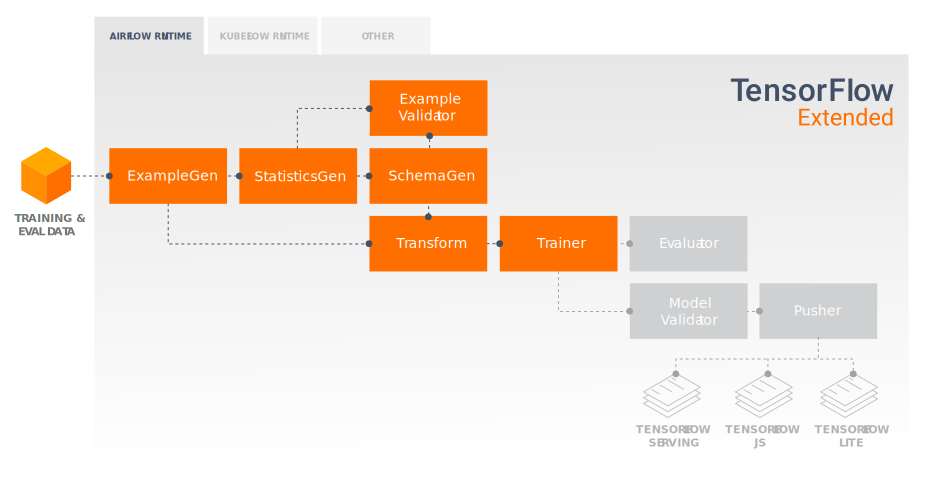

# TFX ユーザーガイド

## イントロダクション

TFXはTensorFlow上で動作する、Googleのプロダクションスケールの機械学習プラットフォームです。
これは機械学習システムを定義、起動、監視するために必要な設定フレームワークと共有ライブラリを提供し、
それらを機械学習システムに統合できるようにします。

## インストール

[](
https://github.com/tensorflow/tfx)
[](https://badge.fury.io/py/tfx)

```
pip install tensorflow
pip install tfx
```

Note: オプションのコンポーネントである [TensorFlow Serving](https://www.tensorflow.org/serving/),
[TensorFlow JS](https://js.tensorflow.org/), 
[TensorFlow Lite](https://www.tensorflow.org/lite) のインストールについては、
これらのドキュメントを確認してください。

Note: このコマンドは [Apache Beam](beam.md) を Direct runner と同時にインストールします。
別途、[Flink](https://flink.apache.org/)のようなストリーミングランナーをインストールする必要があります。

## コアコンポーネント

### TFX パイプライン

TFXパイプラインはいくつかのコンポーネントを用いて、特定の機械学習タスク (例えば、
特定のデータを用いた回帰モデルの構築とデプロイ) を最終的に実行するためのデータフローを定義します。
パイプラインのコンポーネントはTFXのライブラリを用いて構築されます。
パイプラインの最終結果は、推論を要求する TFX デプロイメントターゲットかサービス、またはその両方です。

## TFX パイプライン コンポーネント

TFXパイプラインは一連のコンポーネントを連結したもので、[機械学習パイプライン](https://ja.wikipedia.org/wiki/%E3%83%91%E3%82%A4%E3%83%97%E3%83%A9%E3%82%A4%E3%83%B3%E5%87%A6%E7%90%86)を実装するもので、
スケーラブルでハイパフォーマンスな機械学習タスクのために設計されています。
これにはモデリング、訓練、推論のサービング、そしてオンライン、ネイティブモバイルアプリ、JavaScript へのデプロイの管理が含まれています。

TFX パイプラインには典型的には次のコンポーネントが含まれます :

* [**ExampleGen**](examplegen.md) はパイプラインの先頭に来るコンポーネントで、
データセットの取り込みと、必要な場合には分割を行います。

* [**StatisticsGen**](statsgen.md) はデータセットの統計量を計算します。

* [**SchemaGen**](schemagen.md) 統計量を確認し、データのスキーマを生成します。

* [**ExampleValidator**](exampleval.md) looks for anomalies and missing values
in the dataset.

* [**Transform**](transform.md) performs feature engineering on the dataset.

* [**Trainer**](trainer.md) trains the model.

* [**Evaluator**](evaluator.md) performs deep analysis of the training results.

* [**ModelValidator**](modelval.md) helps you validate your exported models, ensuring that
they are "good enough" to be pushed to production.

* [**Pusher**](pusher.md) deploys the model on a serving infrastructure.

This diagram illustrates the flow of data between these components:



### Anatomy of a Component

TFX components consist of three main pieces:

* Driver
* Executor
* Publisher



#### Driver and Publisher

The driver supplies metadata to the executor by querying the metadata store,
while the publisher accepts the results of the executor and stores them in
metadata. As a developer you will typically not need to interact with the
driver and publisher directly, but messages logged by the driver and publisher
may be useful during debugging.  See [Troubleshooting](#troubleshooting).

#### Executor

The executor is where a component performs its processing.  As a developer you
write code which runs in the executor, based on the requirements
of the classes which implement the type of component that you're working with.
For example, when you're working on a [Transform component](transform.md) you
will need to develop a `preprocessing_fn`.

## TFX Libraries

TFX includes both libraries and pipeline components.  This diagram illustrates
the relationships between TFX libraries and pipeline components:



TFX provides several Python packages that are the libraries which are used to
create pipeline components.  You'll use these libraries to create the components
of your pipelines so that your code can focus on the unique aspects of your
pipeline.

TFX libraries include:

*   [**TensorFlow Data Validation (TFDV)**](tfdv.md) is a library for analyzing
and validating machine learning data. It is designed to be highly scalable and
to work well with TensorFlow and TFX.  TFDV includes:

    * Scalable calculation of summary statistics of training and test data.
    * Integration with a viewer for data distributions and statistics, as well
    as faceted comparison of pairs of datasets (Facets).
    * Automated data-schema generation to describe expectations about data like
    required values, ranges, and vocabularies.
    * A schema viewer to help you inspect the schema.
    * Anomaly detection to identify anomalies, such as missing features, out-of-
    range values, or wrong feature types, to name a few.
    * An anomalies viewer so that you can see what features have anomalies and
    learn more in order to correct them.

*   [**TensorFlow Transform (TFT)**](tft.md) is a library for preprocessing data
with TensorFlow. TensorFlow Transform is useful for data that requires a full-
pass, such as:

    * Normalize an input value by mean and standard deviation.
    * Convert strings to integers by generating a vocabulary over all input
    values.
    * Convert floats to integers by assigning them to buckets based on the
    observed data distribution.

*   [**TensorFlow**](train.md) is used for training models with TFX.  It ingests
training data and modeling code and creates a SavedModel result.  It also
integrates a feature engineering pipeline created by TensorFlow Transform for
preprocessing input data.

*   [**TensorFlow Model Analysis (TFMA)**](tfma.md) is a library for evaluating
TensorFlow models. It is used along with TensorFlow to create an EvalSavedModel,
which becomes the basis for its analysis.  It allows users to evaluate their
models on large amounts of data in a distributed manner, using the same metrics
defined in their trainer. These metrics can be computed over different slices of
data and visualized in Jupyter notebooks.

* [**TensorFlow Metadata (TFMD)**](https://github.com/tensorflow/metadata)
provides standard representations
for metadata that are useful when training machine learning models with
TensorFlow. The metadata may be produced by hand or automatically during input
data analysis, and may be consumed for data validation, exploration, and
transformation. The metadata serialization formats include:

    * A schema describing tabular data (e.g., tf.Examples).
    * A collection of summary statistics over such datasets.

* [**ML Metadata (MLMD)**](mlmd.md)
is a library for recording and retrieving metadata associated with ML developer
and data scientist workflows.  Most often the metadata uses TFMD representations.
MLMD manages persistence using [SQL-Lite](https://www.sqlite.org/index.html),
[MySQL](https://www.mysql.com/), and other similar data stores.

### Supporting Technologies

#### Required

*   [**Apache Beam**](beam.md) is an open source, unified model for defining
both batch and streaming data-parallel processing pipelines. TFX uses Beam to
implement data-parallel pipelines.  The pipeline is then executed by one of
Beam's supported distributed processing back-ends, which include Apache
Flink, Google Cloud Dataflow, and others.

#### Optional

Orchestrators such as Apache Airflow and Kubeflow make configuring, operating,
monitoring, and maintaining an ML pipeline easier.

*   [**Apache Airflow**](orchestra.md) is a platform to programmatically author,
schedule and monitor workflows.  TFX uses Airflow to author workflows as
directed acyclic graphs (DAGs) of tasks. The Airflow scheduler executes tasks on
an array of workers while following the specified dependencies. Rich command
line utilities make performing complex surgeries on DAGs a snap. The rich user
interface makes it easy to visualize pipelines running in production, monitor
progress, and troubleshoot issues when needed.  When workflows are defined as
code, they become more maintainable, versionable, testable, and collaborative.

* [**Kubeflow**](https://www.kubeflow.org/) is dedicated to making deployments
of machine learning (ML) workflows on Kubernetes simple, portable and scalable.
Kubeflow's goal is not to recreate other services, but to provide a
straightforward way to deploy best-of-breed open-source systems for ML to
diverse infrastructures.
[Kubeflow Pipelines](https://www.kubeflow.org/docs/pipelines/pipelines-overview/)
enable composition and execution of reproducible workflows on Kubeflow,
integrated with experimentation and notebook based experiences.
Kubeflow Pipelines services on Kubernetes include the hosted Metadata store,
container based orchestration engine, notebook server, and UI to help users
develop, run, and manage complex ML pipelines at scale.
The Kubeflow Pipelines SDK allows for creation and sharing of components
and composition of pipelines programmatically.


### Orchestration and Portability

TFX is designed to be highly portable to multiple environments and
orchestration frameworks, including Apache Airflow and Kubeflow.  It is also
portable to different computing platforms, including bare-metal and the
Google Cloud Platform (GCP).

Note: The current revision of this user guide primarily discusses deployment
on a bare-metal system using Apache Airflow for orchestration.

### Model vs. SavedModel

#### Model

A model is the output of the training process. It is the serialized record of
the weights that have been learned during the training process. These weights
can be subsequently used to compute predictions for new input examples. For TFX
and TensorFlow, 'model' refers to the checkpoints containing the weights learned
up to that point.

Note that 'model' might also refer to the definition of the TensorFlow
computation graph (i.e. a Python file) that expresses how a prediction will be
computed. The two senses may be used interchangeably based on context.

#### SavedModel

* **What is a [SavedModel](
https://www.tensorflow.org/api_docs/python/tf/saved_model)**: a universal,
language-neutral, hermetic, recoverable serialization of a TensorFlow model.
* **Why is it important**: It enables higher-level systems to produce,
transform, and consume TensorFlow models using a single abstraction.

SavedModel is the recommended serialization format for serving a TensorFlow
model in production, or exporting a trained model for a native mobile or
JavaScript application. For example, to turn a model into a REST service for
making predictions, you can serialize the model as a SavedModel and serve it
using TensorFlow Serving. See [Serving a TensorFlow
Model](https://www.tensorflow.org/serving/tutorials/Serving_REST_simple) for
more information.

### Schema

Some TFX components use a description of your input data called a *schema*. The
schema is an instance of
[schema.proto](
https://github.com/tensorflow/metadata/tree/master/tensorflow_metadata/proto/v0).
Schemas are a type of [protocol buffer](
https://developers.google.com/protocol-buffers/), more generally known as a
"protobuf".  The schema can specify data types for feature values,
whether a feature has to be present in all examples, allowed value ranges, and
other properties.  One of the benefits of using TensorFlow Data Validation
(TFDV) is that it will automatically generate a schema by inferring types,
categories, and ranges from the training data.

Here's an excerpt from a schema protobuf:

```proto
...
feature {
  name: "age"
  value_count {
    min: 1
    max: 1
  }
  type: FLOAT
  presence {
    min_fraction: 1
    min_count: 1
  }
}
feature {
  name: "capital-gain"
  value_count {
    min: 1
    max: 1
  }
  type: FLOAT
  presence {
    min_fraction: 1
    min_count: 1
  }
}
...
```

The following components use the schema:

*   TensorFlow Data Validation
*   TensorFlow Transform

In a typical TFX pipeline TensorFlow Data Validation generates a schema, which
is consumed by the other components.

Note: The auto-generated schema is best-effort and only tries to infer basic
properties of the data. It is expected that developers review and modify it as
needed.

## Developing with TFX

TFX provides a powerful platform for every phase of a machine learning project,
from research, experimentation, and development on your local machine, through
deployment. In order to avoid code duplication and eliminate the potential for
[training/serving skew](#training-serving-skew-detection) it is strongly
recommended to implement your TFX pipeline for both model training and
deployment of trained models, and use [Transform](transform.md) components which
leverage the [TensorFlow Transform](tft.md) library for both training and
inference. By doing so you will use the same preprocessing and analysis code
consistently, and avoid differences between data used for training and data fed
to your trained models in production, as well as benefitting from writing that
code once.

### Data Exploration, Visualization, and Cleaning



TFX pipelines typically begin with an [ExampleGen](examplegen.md) component, which
accepts input data and formats it as tf.Examples.  Often this is done after the
data has been split into training and evaluation datasets so that there are
actually two copies of ExampleGen components, one each for training and evaluation.
This is typically followed by a
[StatisticsGen](statsgen.md) component and a [SchemaGen](schemagen.md) component,
which will examine your data and infer a data
schema and statistics.  The schema and statistics will be consumed by an
[ExampleValidator](exampleval.md) component, which will look for anomalies, missing
values, and incorrect data types in your data.  All of these components leverage the
capabilities of the [TensorFlow Data Validation](tfdv.md) library.

[TensorFlow Data Validation (TFDV)](tfdv.md) is a valuable tool when doing
initial exploration, visualization, and cleaning of your dataset.  TFDV examines
your data and infers the data types, categories, and ranges, and then
automatically helps identify anomalies and missing values.  It also provides
visualization tools that can help you examine and understand your dataset.
After your pipeline completes you can read metadata from [MLMD](mlmd.md) and use
the visualization tools of TFDV in a Jupyter notebook to analyze your data.

Following your initial model training and deployment, TFDV can be used to
monitor new data from inference requests to your deployed models, and look for
anomalies and/or drift.  This is especially useful for time series data that
changes over time as a result of trend or seasonality, and can help inform when
there are data problems or when models need to be retrained on new data.

### Data Visualization

After you have completed your first run of your data through the section of your
pipeline that uses TFDV (typically StatisticsGen, SchemaGen, and
ExampleValidator) you
can visualize the results in a Jupyter style notebook.  For additional runs
you can
compare these results as you make adjustments, until your data is optimal
for your
model and application.

You will first query
[**ML Metadata (MLMD)**](mlmd.md) to locate the results of these executions
of these components, and then use the visualization support API in TFDV to
create
the visualizations in your notebook.  This includes [tfdv.load_statistics()](
`tfdv.load_statistics`)
and [tfdv.visualize_statistics()](`tfdv.visualize_statistics`)
Using this visualization you can better understand the characteristics of your
dataset, and if necessary modify as required.

### Developing and Training Models



A typical TFX pipeline will include a [Transform](transform.md) component, which
will perform feature engineering by leveraging the capabilities of the
[TensorFlow Transform (TFT)](tft.md) library.  A Transform component consumes
the schema created by a SchemaGen component, and applies [data transformations](
//tfx/transform/api_docs/python/tft) to
create, combine, and transform the features that will be used to train your
model. Cleanup of missing values and conversion of types should also be done in
the Transform component if there is ever a possibility that these will also be
present in data sent for inference requests.  [There are some important
considerations](train.md) when designing TensorFlow code for training in TFX.



The result of a Transform component is a SavedModel which will be imported and
used in your modeling code in TensorFlow, during a [Trainer](trainer.md)
component.  This
SavedModel includes all of the data engineering transformations that were
created in the Transform component, so that the identical transforms are
performed
using the exact same code during both training and inference.  Using the
modeling code, including the SavedModel from the Transform component, you can
consume your training and evaluation data and train your model.

During the last section of your modeling code you should save your model as both
a SavedModel and an EvalSavedModel.  Saving as an EvalSavedModel will require
you to import and apply [TensorFlow Model Analysis (TFMA)](tfma.md) library in
your Trainer component.

```python
import tensorflow_model_analysis as tfma
...

tfma.export.export_eval_savedmodel(
        estimator=estimator,
        export_dir_base=eval_model_dir,
        eval_input_receiver_fn=receiver_fn)
```

### Analyzing and Understanding Model Performance



Following initial model development and training it's important to analyze and
really understand you model's performance.  A typical TFX pipeline will include
an [Evaluator](evaluator.md) component, which leverages the capabilities of the
[TensorFlow Model Analysis (TFMA)](tfma.md) library, which provides a power
toolset for this phase of development.  An Evaluator component consumes the
EvalSavedModel that you exported above, and allows you to specify a list of
`SliceSpecs` that you can use when visualizing and analyzing your model's
performance. Each SliceSpec defines a slice of your training data that you want
to examine, such as particular categories for categorical features, or
particular ranges for numerical features.

For example, this would be important for trying to understand your model's
performance for different segments of your customers, which could be segmented
by annual purchases, geographical data, age group, or gender.  This can be
especially important for datasets with long tails, where the performance of a
dominant group may mask unacceptable performance for important, yet smaller
groups.  For example, your model may perform well for average employees but fail
miserably for executive staff, and it might be important to you to know that.

### Model Analysis and Visualization

After you have completed your first run of your data through training your
model and running the [Evaluator](evaluator.md) component (which leverages
[TFMA](tfma.md)) on the training results, you can visualize the results in a
Jupyter style notebook.  For additional runs you can compare these results as
you make adjustments, until your results are optimal for your model and
application.

You will first query
[**ML Metadata (MLMD)**](mlmd.md) to locate the results of these
executions
of these components, and then use the visualization support API in TFMA to create
the visualizations in your notebook.  This includes [tfma.load_eval_results()](
https://www.tensorflow.org/tfx/model_analysis/api_docs/python/tfma/load_eval_results)
and [tfma.view.render_slicing_metrics()](`tfma/view/render_slicing_metrics`)
Using this visualization you can better understand the characteristics of your
model, and if necessary modify as required.

## Deployment Targets

Once you have developed and trained a model that you're happy with, it's now
time to deploy it to one or more deployment target(s) where it will receive
inference requests.  TFX supports deployment to three classes of deployment
targets.  Trained models which have been exported as SavedModels can be deployed
to any or all of these deployment targets.


### Inference: TensorFlow Serving

[TensorFlow Serving (TFS)](serving.md) is a flexible, high-performance serving
system for machine learning models, designed for production environments. It
consumes a SavedModel and will accept inference requests over either REST or
gRPC interfaces.  It runs as a set of processes on one more more network
servers, using one of several advanced architectures to handle synchronization
and distributed computation.  See the [TFS documentation](serving.md) for more
information on developing and deploying TFS solutions.

In a typical pipeline a [Pusher](pusher.md) component will consume SavedModels which
have been trained in a Trainer component and deploy them to your TFS infrastructure.
This includes handling multiple versions and model updates.

### Inference in Native Mobile and IoT Applications: TensorFlow Lite

[TensorFlow Lite](https://www.tensorflow.org/lite) is a suite of tools which is
dedicated to help developers use their trained TensorFlow Models in native
mobile and IoT applications.  It consumes the same SavedModels as TensorFlow
Serving, and applies optimizations such as quantization and pruning to optimize
the size and performance of the resulting models for the challenges of running
on mobile and IoT devices.  See the TensorFlow Lite documentation for more
information on using TensorFlow Lite.

### Inference in JavaScript: TensorFlow JS

[TensorFlow JS](https://js.tensorflow.org/) is a JavaScript library for training
and deploying ML models in the browser and on Node.js.  It consumes the same
SavedModels as TensorFlow Serving and TensorFlow Lite, and converts them to the
TensorFlow.js Web format.  See the TensorFlow JS documentation for more details
on using TensorFlow JS.

## Creating a TFX Pipeline With Airflow

### Install

Airflow can be installed from PyPi:

```python
# Airflow
# set this to avoid the GPL version; no functionality difference either way
export SLUGIFY_USES_TEXT_UNIDECODE=yes
pip install apache-airflow
```

### Creating a DAG

You create a TFX pipeline by developing Python which defines a function that is
decorated with the `tfx.runtimes.tfx_airflow.PipelineDecorator` and creates your
pipeline components, linking them together in the sequence that the pipeline needs.
In the global context of the file you then call `create_pipeline()`. For
example, a typical pipeline might look like:

```python
@PipelineDecorator(
    pipeline_name='tfx_example_solution',
    schedule_interval=None,
    start_date=datetime.datetime(2018, 1, 1),
    enable_cache=True,
    additional_pipeline_args={'logger_args': logging_utils.LoggerConfig(
        log_root='/var/tmp/tfx/logs', log_level=logging.INFO)},
    metadata_db_root=os.path.join(home_dir, 'data/tfx/metadata'),
    pipeline_root=pipeline_root)
def create_pipeline():
  """Implements the example pipeline with TFX."""
  examples = csv_input(os.path.join(base_dir, 'no_split/span_1'))
  example_gen = CsvExampleGen(input_data=examples)
  statistics_gen = StatisticsGen(input_data=example_gen.outputs.output)
  infer_schema = SchemaGen(stats=statistics_gen.outputs.output)
  validate_stats = ExampleValidator(  # pylint: disable=unused-variable
      stats=statistics_gen.outputs.output,
      schema=infer_schema.outputs.output)
  transform = Transform(
      input_data=example_gen.outputs.output,
      schema=infer_schema.outputs.output,
      module_file=transforms)
  trainer = Trainer(
      module_file=model,
      transformed_examples=transform.outputs.transformed_examples,
      schema=infer_schema.outputs.output,
      transform_output=transform.outputs.transform_output,
      train_steps=10000,
      eval_steps=5000,
      warm_starting=True)
  model_analyzer = Evaluator(
      examples=example_gen.outputs.output,
      model_exports=trainer.outputs.output)
  model_validator = ModelValidator(
      examples=example_gen.outputs.output,
      model=trainer.outputs.output)
  pusher = Pusher(
      model_export=trainer.outputs.output,
      model_blessing=model_validator.outputs.blessing,
      serving_model_dir=serving_model_dir)

  return [
      example_gen, statistics_gen, infer_schema, validate_stats, transform,
      trainer, model_analyzer, model_validator, pusher
  ]

pipeline = TfxRunner().run(create_pipeline())
```

### Initializing Your TFX Pipeline With Airflow

When you install [Apache Airflow](orchestra.md) it will initialize your
`$AIRFLOW_HOME` (`~/airflow` by default) directory where you will create
pipelines.  You then need to create the directories that will hold your
pipeline code:

```bash
mkdir -p ~/airflow/dags     # or $AIRFLOW_HOME/dags
mkdir -p ~/airflow/data     # or $AIRFLOW_HOME/data
mkdir -p ~/airflow/plugins  # or $AIRFLOW_HOME/plugins
```

#### Pipeline Config

The only real requirement in structuring your code is that the Python file
which includes your `create_pipeline()` function (your "pipeline config") must
be placed in your `dags` folder.  We recommend that the Python file containing
your DAG be named to match the DAG name, so if your DAG is named `taxi` then
that file should be named `taxi.py`.

The `create_pipeline()` function in your pipeline config is decorated with a
`PipelineDecorator` which is where you set your `pipeline_name`,
among other things.  These are important for recognizing your pipeline by name
in the Airflow web UI, and locating the log files for your pipeline.


#### Deploying Your Pipeline Code

You deploy and name your pipeline config as described in the previous section.

You deploy the remainder of your pipeline code by creating folders under `data`
and `plugins` to hold your pipeline code. A good practice is to name these
folders to match the name of your pipeline when naming your
output_dir (which you set in your `PipelineDecorator`), so if your pipeline is
named `taxi`, you might name your output_dir:

```bash
mkdir -p ~/airflow/data/taxi     # or $AIRFLOW_HOME/data/taxi
mkdir -p ~/airflow/plugins/taxi  # or $AIRFLOW_HOME/plugins/taxi

```

```python
home_dir = os.path.join(os.environ['HOME'], 'airflow/')
base_dir = os.path.join(home_dir, 'data/taxi/')
output_dir = os.path.join(base_dir, 'pipelines/')
```

If you are planning to use files to hold your dataset(s), you should copy your
data files into your `data` folder:

```bash
cp data.csv ~/airflow/data/taxi     # or $AIRFLOW_HOME/data/taxi
```

### Example Code

By convention your pipeline config should contain only the code necessary to
configure your pipeline, as in
[this example](
https://github.com/tensorflow/tfx/blob/master/tfx/examples/chicago_taxi_pipeline/taxi_pipeline_simple.py).

The supporting code, such as your TensorFlow model and your Transform
`preprocessing_fn`, should all go in a single file, as in
[this example](
https://github.com/tensorflow/tfx/blob/master/tfx/examples/chicago_taxi_pipeline/taxi_utils.py).

## Deploying and Operating a TFX Pipeline

New pipelines must then be enabled in the Airflow web UI in order to start them
running.  In many cases they will also need to be triggered in the web UI. When
you want to stop running a pipeline you can disable it, also in the Airflow web
UI.  You can also examine the current state and history of your pipeline in the
Airflow web UI, including logs.

### Starting and Updating Your Pipeline

If your pipeline is not already running, you will need to start Airflow from the
command line:

```bash
airflow webserver -p 8080
airflow scheduler
```

#### Updating your code

You can make changes to your pipeline code after deployment.  When you make a
change you will need to wait for the next Airflow refresh (default is 1 minute)
and then refresh the Airflow web UI page in your browser to see your changes.
If you change the `pipeline_name` of your pipeline, the old name will still
be displayed but will show as missing.

#### Using Notebooks for Visualization

Jupyter style notebooks are very useful for inspecting the inputs and outputs
of TFX components in your pipeline, and comparing results between executions.
In addition, both TFDV and TFMA include powerful visualization support that
developers can use to explore their dataset and analyze their modeling results
in detail.

## Troubleshooting

### Finding Errors In Log Files

TFX will generate log entries in the location defined by the LoggerConfig, set
as an additional argument in the PipelineDecorator. The default is
`/var/tmp/tfx/logs/tfx.log`. In addition, the orchestrator (e.g. Airflow,
Kubeflow) will also generate log files. When trying to diagnose errors in your
pipeline, these log files are very valuable. For a pipeline named `taxi` with no
LoggerConfig specified in your pipeline, the TFX logs will be written to
`/var/tmp/tfx/logs/tfx.log`. This is customizable by creating a
[logging_utils.LoggerConfig](https://github.com/tensorflow/tfx/blob/master/tfx/utils/logging_utils.py)
object and adding it as an additional parameter called `logger_args` in your
pipeline configuration:

```python
@PipelineDecorator(
    pipeline_name='tfx_example_solution',
    schedule_interval=None,
    start_date=datetime.datetime(2018, 1, 1),
    enable_cache=True,
    additional_pipeline_args={'logger_args': logging_utils.LoggerConfig(
        log_root='/var/tmp/tfx/logs', log_level=logging.INFO)},
    metadata_db_root=os.path.join(home_dir, 'data/tfx/metadata'),
    pipeline_root=pipeline_root)
```

Note: if you are running the executors remotely via Docker or Kubeflow, the
executor logs will be written onto the remote worker.

If you are using Airflow, the log entries will also be written to the Airflow
logs. The default for the Airflow logs is `$AIRFLOW_HOME/logs` and will contain
the following files:

```
$AIRFLOW_HOME/logs/scheduler/{DATE}/taxi.py.log
$AIRFLOW_HOME/logs/scheduler/latest/taxi.py.log
$AIRFLOW_HOME/logs/taxi
$AIRFLOW_HOME/logs/taxi.COMPONENT_NAME
```

### Pipeline is listed, but when triggering Airflow cannot find

Try restarting the webserver and scheduler.

## Creating a TFX Pipeline With Kubeflow

### Setup

Kubeflow requires a Kubernetes cluster to run the pipelines at scale.
See the Kubeflow deployment guideline that guide through the options for
[deplopying the Kubeflow cluster.] (https://www.kubeflow.org/docs/started/getting-started-gke/)

### Configure and run TFX pipeline

Please follow the Kubeflow Pipelines [instructions](https://github.com/kubeflow/pipelines/tree/master/samples/tfx-oss)
to run the TFX example pipeline on Kubeflow.
TFX components have been containerized to compose the Kubeflow pipeline and
the sample illustrates the ability to configure the pipeline to read large 
public dataset and execute training and data processing steps at scale in the cloud.


